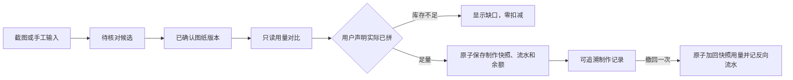

# 拼豆库存与图纸用量：根规格（Root Spec）

版本：1.4 · 日期：2026-09-20
产品暂定名：**豆计**（计算豆的工具，谐音「斗鸡眼」；用户暂定，正式命名后续再定）。
交付目标：可安装、可离线记账、能完成真实拼豆闭环的个人 Android 应用；为后续微信小程序保留必要的复用和迁移能力。
文档状态：沿用 Android 优先、后续自动识别的阶段边界。v1.3 回填用户确认的 WebP 支持并建立识图专项。v1.4 按用户要求，以 Luna max 市场调研进一步细化核对成本、失败恢复与部分结果解释；研究建议不自动变成新增产品范围。规格发布不代表算法、Android 真机或新格式支持已通过验收，官方色值及分享视觉验收仍按既有记录处理。

本文是开发拆分和验收的根规格入口。原需求书 1.0 与决议记录保留为来源；本文纳入后续已确认的百分比预警、1000 颗预填、零用量已拼和使用成就等决定。已确认规则不因技术选型而改变。用户已授权主会话决定技术实现，不再将框架、数据库、备份编码或测试方法作为用户问卷。新增产品体验及实质边界冲突在[直接确认记录](./to-questionnaire-root-spec.md)中逐项询问用户；技术事实缺证据由主会话核验。

## 开发原则

**满足已确认的需求并通过实际验收是最重要的；技术实现路径可以调整，不得为了实现或坚持某项特定技术而阻塞交付。** 本文的技术选型、算法和处理步骤是实现方案，依据真实样例与平台运行结果判断是否适用；某条路线不适用时，主会话在既有授权内选择能满足同一需求的更合适方案，并记录调整依据。

技术调整须保持已确认的功能结果、数据保护和必要验收，不能以手工纠错冒充自动识别通过，或以工具调用成功代替用户目标达成。涉及产品范围、体验、数据语义、隐私或费用的实质变化，仍按已有授权和决策规则处理。

## Problem Statement

### 1. 用户真正要解决的问题

用户在小红书等渠道发现想拼的图纸，手头已经有一批 MARD 拼豆，却很难快速回答：这张图要用哪些色、各多少颗；家里够不够；缺的该补多少；实际拼完以后还剩多少。同时，用户希望知道自己已经使用了多少拼豆、完成了多少制作，让消耗记录成为可见的制作成就。

图纸可能带有逐色数量图例，也可能只有制作网格中的色号；截图识别可能漏读。库存可能只是估算，批量录入可能填错，点击“已拼”可能误触。产品必须让这些不确定性可见、可修正，并保证每次实际扣减准确、完整、可追溯。把识别结果直接当成账本，或靠用户记住有没有扣过，都会破坏这个目标。

### 2. 目标用户与使用环境

- **首位用户**：单设备自用的拼豆爱好者，主要使用 Android 手机；平板需要触屏适配。
- **未来目标客群**：活跃于小红书、会保存图纸并分享制作成果的个人拼豆爱好者。这是用户指定的产品定位，不是本轮调研测得的人口统计结论；不擅自限定年龄、性别或购买力。
- **典型环境**：一边整理豆盒一边连续录入数量；选图时查看缺色；实际拼完后记一次消耗；断网时仍能手工录入和记账；在朋友圈或小红书分享一张清楚、美观的图片。
- **非目标用户**：首版不为门店、多仓、团队接单或多人协作设计。

### 3. 已确认的产品底线

1. Android 是第一阶段核心场景和完整功能验证载体，交付实际安装包。后续发行微信小程序，代码和数据设计应考虑接续。
2. 少即是多：先做好“库存 → 图纸用量确认 → 缺口 → 已拼扣减 → 撤回/恢复”，不以功能数量衡量完成度。
3. 界面简洁美观，适合小红书活跃用户；首版内置朋友圈和小红书分享模板。
4. 未来收入方式仅考虑广告和买断。首版自用不接真实广告或支付；现在只明确能力边界。
5. 库存和图纸按已确认的 MARD 221 色号、以颗为单位。社区屏幕参考色不充当官方精确色值，也不决定计数。
6. 正确记账、手工兜底、离线使用和完整备份不能为了做快 demo 被省略。
7. 耗材管理同时关注余量与已使用量；使用记录也是成就。总用量为零的图纸也允许标记已拼，不能因没有用量数字而阻止记录完成。

## Solution

### 1. 一次完整的使用闭环

首次打开，直接进入可搜索的 MARD 221 库存清单。首次录入预填 1000 颗，用户确认持有后才加入本次保存；未录入色号保持零。库存总览同时展示累计已用总颗数和完成作品数，各色库存条目可查看该色已用颗数；不为此增加一个复杂的成就系统。第一阶段导入 PNG/JPG 后手工录入逐色用量，通过整体确认保存图纸；在线识别及相关候选核对在后续接入。

图纸详情回答“需要多少、手头有多少、缺哪些”。预估不扣库存。用户实际拼完，点击“已拼”立即完成一次整体扣减；同一动作的连点和重试只记一次。再次完成另一件作品时使用“再拼一次”。误记可撤回任意一条制作记录，库存有偏差可做盘点更正。

用户可查看已记录使用量与完成次数，积累制作成就；也可以生成朋友圈或小红书的分享图片、手工导出完整备份。恢复备份先看差异，再明确选择整体替换或取消。后续小程序首先接收这份备份，再单独设计账号与多设备同步。

### 2. 阶段边界

| 阶段 | 必须交付 | 完成条件 |
| --- | --- | --- |
| Android 开发前验证 | Android 构建/安装、一次真实记账与事务落盘、本机文件及本地图片输出 | 高风险平台依赖有实际证据；不以网页预览代替 Android 能力 |
| 第一阶段：自用 Android | 库存、手工图纸用量、缺口、制作/撤回、使用成就、完整备份恢复、本地双模板分享图片、签名安装包 | 安卓真机完整闭环及首版验收通过；用户完成体验与审美验收；不依赖在线 OCR、小程序或外部账号/支付服务 |
| 第一阶段可选探索（不阻塞交付） | 小规模实测不使用文字识别的图纸计数办法，记录自动计数和人工补充的边界 | 有输入、逐色参考答案、实际结果和限制；无可用方案也不阻止 Android 交付，不冒充已上线识别能力 |
| 安卓交付后：微信小程序 | 复用已验证的计算和规则，适配微信运行时，从 Android 备份接续数据 | 在获准测试环境和真机证明迁移及本地闭环可用；另行确认发行 |
| 安卓交付后：自动计数与外接识别 | 图例用量提取、无图例图纸本体计数、候选核对及必要外部服务 | 各色结果、疑点和失败路径实测通过；采用在线服务时另验证完整删除链路；不固定 OCR 或网格定位技术 |
| 更后续的外接能力 | 账号、多设备同步、广告和买断 | 先确认数据冲突规则、成本、主体资格和权益范围，再拆实施票；不成为前面阶段的交付条件 |

2026-09-20 追加确认：**后续识图更新必须支持 WebP，用户无需手动转为 PNG/JPG**；导入、原图核对、识别、缩略图、分享与备份恢复均须验证。具体算法及验收见[图纸识别更新专项规格](./docs/specs/image-recognition.md)。 2026-09-20 用户随后明确本地算法验收：现有 18 张仅为基础回归，至少 15/18 色号全部正确且每色数量误差不超过 `max(真值×10%,3颗)`；无完整参考答案不能算通过。基础完成后冻结算法，由 Luna max 收集 30 张新图另验泛化，正确性优先，之后再精简。该数值容差用于本轮识别候选实验，不改变库存计算与扣减的精确规则。随后用户追加再收集100张新图验证，沿用相同容差；冻结后的首次结果、失败与来源重复分别记录，不以旧图或改色版补足数量。这项更新不追溯改写既有首版支持范围或真机验收记录，也不将新算法变为首版交付的反向依赖。

按本轮反馈取消“根据厂商预设录入数量”的后续计划；继续按 MARD 221 色号记账，首次预填 1000 颗并允许修改。原需求书列出的图片转网格、多品牌等属于后续候选，不自动进入首版，也不在本规格中承诺其排期。首版 demo 是能自用的完整小闭环，不是用假数据掩盖缺失功能的演示。

以上阶段顺序由用户确认：Android 先交付，小程序和外接随后分别推进；两条后续工作线没有必要互相串行，跨端集成验收才依赖双方完成。第一阶段的分享是本地生成和保存图片，不包含平台登录、发布或直达 SDK。自动计数探索不作为首版自动识别承诺；不能因方案探索或后续接口尚未完成而卡住 Android 交付。

2026-09-22 用户授权连续完成 #7、#8、#9，并明确先在已连接 Android 上验证、无问题再提 PR。本轮目标应用版本 0.2.0：原图输入、手机本地自动识别、原图核对与整体确认、来源/风险持久化及备份 v2；固定 MARD 221，不接在线服务。运行资源随包准备，手机不下载模型或上传图片。正式签名/公开发行及用户审美验收仍沿用原责任边界。此前算法阶段“不提交、不推送”的临时限制由本次明确 PR 授权取代。

2026-09-23 用户再次明确：当前尚无发行版本，均处于开发阶段，不为旧开发版备份兼容新增实现或设置交付门槛；本轮只验当前备份的完整恢复及实际数据保护。#10 继续在 #7–#9 的 PR #16 上开发，不另开 PR。修改图纸不能追改已有制作记录的用量，这是现行记账规则，不属于旧备份兼容要求。

2026-09-23 本轮继续基于 PR #16 实施 #11，收尾图例异常核对与知情确认；#12 无图例本体计数、#13 长图/密集图和 #14 综合验收仍是后续任务。明确来源冲突的自动数量不进入正式用量，可保留原文和风险继续手工补录；确认版如实记录原始识别失败及人工参与。标题总数沿用安全整数边界，不将单色 10 亿限制套在逐色合计或标题总数上。具体实现、支持范围及验证见 [#11 验收记录](docs/acceptance/issue11/README.md)。

2026-09-23 用户继续授权基于 PR #16 实施 #12。复用逐格识别和同一确认入口，保留可用的部分本体用量、逐行未知格位置、两路数量冲突及原始自动用量。真实无数量表的小图与裁掉数量表的派生图分别记录；本轮四张真实小图及 148 派生图逐色逐数一致，水印爱心仍为不支持全自动准确计数的边界。Android 核对、人工修改、重开和当前备份恢复使用隔离账本；详细范围及证据见 [#12 验收记录](docs/acceptance/issue12/README.md)。#13 长图/密集图及 #14 综合验收不并入本次实现。

### 3. 页面与交互设计建议

建议以“库存、图纸”两个主入口组织功能；备份和基础说明收在设置中，制作历史从图纸详情及库存变动记录进入。分享从当前图纸详情进入。避免为了少页面把盘点、补货与制作扣减挤成含糊的同一个操作。

2026-09-22 用户确认首页“已录入的库存优先；全部色号按组展开”，并要求参考 [Apple 设计规范](https://developer.apple.com/cn/design/)。豆仓默认查看已录入库存，库存及完整色卡均按既有 9 个色系组织，避免默认展开 221 色长列表；搜索覆盖全部色号，已录入的零余额仍保留。采用清楚的导航、分组列表、搜索范围和字体层级；这不改变 Android 平台、色卡或账本规则，具体视觉由真机展示后用户验收。

| 页面/场景 | 首要信息 | 主操作与必要状态 |
| --- | --- | --- |
| 库存 | 色号、参考色、当前颗数、估算标记、各色已用颗数；总览展示累计已用总颗数和完成作品数 | 搜索色号、按色系浏览、百分比预警、盘点、补货；空库存说明如何开始 |
| 批量盘点/补货 | 旧余额、填写的新总数、估算/精确标记 | 连续输入；提交前统一预览；逐色指出错误，整批提交 |
| 图纸列表 | 缩略图、名称、已确认总需求、制作记录摘要 | 导入图纸；不以“已拼”状态隐藏再制作入口 |
| 导入与用量确认 | 当前截图、逐色用量、总数与差异 | 首版手工录入、逐项修改、一个主按钮确认全部用量；后续增加自动候选及识别状态 |
| 图纸详情 | 总需求、涉及颜色数、逐色库存/缺口/余量 | 已拼/再拼一次、编辑用量、补货清单、分享、历史 |
| 制作/库存记录 | 时间、操作原因、逐色前后余额 | 从制作记录撤回一次制作；已撤回状态持续可见 |
| 分享预览 | 平台模板及实际将导出的内容 | 切换朋友圈/小红书模板、保存图片；失败可重试 |
| 备份与恢复 | 导出范围；导入前后差异及影响 | 导出完整备份；整体替换或取消，失败保留原数据 |

**审美方向是待用户验收的设计建议**：采用留白充足、接近手作记录本的轻盈界面，用少量低饱和强调色和整齐的色号标签组织信息。作品缩略图是视觉重点，数字和状态必须清楚。小红书定位不等于大面积粉色、幼态字体、满屏装饰或仿造平台界面。

首轮视觉稿需同时覆盖空状态、221 色库存、缺色详情、手工用量校验与总数差异、两种分享模板；识别警告在后续识别阶段补充。数字键盘不遮住保存操作；触控区域满足手机可用性；色号、数字和文字状态始终可见，不能只靠颜色区分估算、缺货或成功。字体放大、长名称和浅色豆块均需验证。固定模板先做好，不增加自由排版编辑器。

## User Stories

以下故事按条目标记的阶段验收；未标“后续”的条目属于首版。每条描述用户结果，不等于必须拆成一个页面或一个模块。

1. 作为自用者，我希望安装 Android 应用后直接开始录入，以便无需注册就能试用完整闭环。
2. 作为拼豆爱好者，我希望找到全部 MARD 221 色号，以便用自己实际持有的色号记账。
3. 作为拼豆爱好者，我希望颜色块旁始终有色号和社区版参考色说明，以便不把屏幕颜色误认为官方精确色。
4. 作为盘点者，我希望按色号搜索和按色系浏览，以便快速找到豆盒对应条目。
5. 作为盘点者，我希望连续填写多个色号的当前颗数，以便不必逐色打开和保存页面。
6. 作为盘点者，我希望未填写色号保持零，以便少量持色也能开始使用。
7. 作为盘点者，我希望逐色标记估算或精确，以便知道哪些数字需要谨慎参考。
8. 作为盘点者，我希望只修改估算标记也能保存并留痕，以便完成实际清点后更新可信程度。
9. 作为盘点者，我希望提交前看到本批变更，以便及时发现填错的数量。
10. 作为盘点者，我希望一批变更全部成功或全部失败，以便账本不会处于半保存状态。
11. 作为采购者，我希望补货时填写“现在共有多少颗”，以便不用自己换算增加量。
12. 作为采购者，我希望补货中填写减少的色号被明确指出并阻止整批保存，以便改走正确的盘点更正流程。
13. 作为使用者，我希望错误库存能通过盘点更正修正，以便账面重新符合实际余量。
14. 作为使用者，我希望查看库存变动的原因和前后余额，以便知道数字为什么变了。
15. 作为选图者，我希望从本机选择 PNG/JPG 图纸并预览，以便确认没有导错图片；后续识图更新同级支持 WebP，无需手工转换。
16. 作为选图者，我希望填写图纸名称、来源备注和尺寸，以便以后辨认和复核。
17. 作为选图者，我希望主动发起图例用量自动提取，以便减少逐色抄写。【后续】
18. 作为注重隐私的用户，我希望采用在线识别时只有主动选择的当前截图被发送并在处理后删除，以便库存和历史留在设备上。【后续】
19. 作为选图者，我希望识别结果列出每个色号和颗数，以便核对后再用于计算。【后续】
20. 作为选图者，我希望修正错项、删除误识别并补上漏项，再通过一个按钮确认全部用量，以便不用逐色重复确认。
21. 作为选图者，我希望看到色卡外识别项及未计入数量，以便知道系统没有把它们算进去。【后续】
22. 作为选图者，我希望看过拒绝提示后仍可继续确认，以便保留已接受的忽略路径及其风险提示。【后续】
23. 作为选图者，我希望标题总数与逐色合计不符时看到差值并再次明确确认，以便自己判断实际用量。
24. 作为选图者，我希望部分识别时被明确告知，以便不会误以为已经读全。【后续】
25. 作为选图者，我希望独立手工录入逐色用量，以便无需识别服务也能完成导入。
26. 作为离线用户，我希望选择截图、手工录入并保存图纸，以便断网也能做准备。
27. 作为制作前的用户，我希望看到总需求、用色数和每色预计余量，以便判断是否能开始。
28. 作为制作前的用户，我希望不足色号显示缺口且能导出补货清单，以便只买实际缺少的豆子。
29. 作为制作前的用户，我希望多次预估都不改变库存，以便自由比较图纸。
30. 作为制作中的用户，我希望半成品不自动扣库存，以便继续按实际完成事件记账。
31. 作为已完成作品的用户，我希望点击“已拼”立即完整扣减，以便不用重复确认。
32. 作为已完成作品的用户，我希望不足时整次扣减被阻止，以便账面不会出现负库存或少扣。
33. 作为已完成作品的用户，我希望先更正账面至足量后可以完整记入制作，以便实际完成与账面最终一致。
34. 作为用户，我希望连点和重试不重复扣减，以便操作延迟不会损害库存。
35. 作为重复制作的用户，我希望明确点击“再拼一次”记录另一件作品，以便同一图纸可重复使用。
36. 作为误触的用户，我希望撤回任意一次制作并恢复该次用量，以便不用手工计算反向补数。
37. 作为用户，我希望撤回本身留下记录且不能重复恢复，以便历史仍可解释。
38. 作为编辑图纸的用户，我希望旧制作记录保留当时用量，以便修改新图纸不改写旧账。
39. 作为离线用户，我希望查看库存、盘点更正、完成和撤回制作，以便网络不影响本地账本。
40. 作为用户，我希望估算库存扣减后仍标为估算，以便不会被计算过程误导成精确值。
41. 作为朋友圈分享者，我希望应用内提供适合朋友圈展示的固定图片模板，以便少操作就能分享。
42. 作为小红书分享者，我希望应用内提供适合小红书全屏图浏览的固定图片模板，以便清楚、美观地呈现作品和图纸。
43. 作为分享者，我希望在输出前预览真实分享内容，以便检查作品和图纸的展示效果。
44. 作为分享者，我希望分享内容默认不暴露库存余额或历史，以便自主控制对外信息。
45. 作为分享者，我希望图片能够保存并在没有平台直达能力时手动发布，以便分享功能不依赖单一 SDK。
46. 作为分享者，我希望未完成图纸不会被写成已完成作品，以便内容符合实际状态。
47. 作为用户，我希望手工导出包括库存、图纸和全部历史的完整备份，以便重装或换机后恢复。
48. 作为用户，我希望备份保留可辨认的图纸缩略图和确认用量，以便恢复后可以继续记账。
49. 作为用户，我希望恢复前看见与现有数据的差异，以便理解整体替换的影响。
50. 作为用户，我希望取消或恢复失败时现有数据仍完整，以便不会因错误文件损失记录。
51. 作为用户，我希望清楚知道备份不包含原始大图，以便不期待恢复后逐格放大阅读。
52. 作为用户，我希望任何输入、识别或保存失败都给出可理解的原因，以便知道如何继续。
53. 作为手机用户，我希望输入、搜索、预览和保存操作适合触屏，以便连续操作不会费力。
54. 作为色觉或视力不同的用户，我希望色号、数字和文字状态可读，以便不依赖辨色也能使用。
55. 作为库存使用者，我希望看到低库存提示并与当前图纸缺口分清，以便知道是在看日常余额还是某件作品的补货需求。
56. 作为用户，我希望看见累计已用总颗数，以便感受到自己投入的制作量。
57. 作为用户，我希望查看各色已经使用的颗数，以便了解自己的用色习惯。
58. 作为用户，我希望看见完成作品数且零用量图纸也能记完成，以便保留我的制作成就。
59. 作为未来小程序用户，我希望导入 Android 备份后接续库存及历史，以便切换平台不重抄数据。【后续】
60. 作为未来用户，我希望广告和买断的范围清楚且购买可恢复，以便明白自己获得什么。【后续；具体权益待确认】
61. 作为没有逐色数量图例的图纸使用者，我希望从图纸内容取得可核对的逐色用量，并能发现和修正识别疑点，以便不必抄数整张图纸。【后续；支持范围须经样例验证】

用户已确认分享卡默认展示作品和图纸，具体信息与排版本轮留空；小红书全屏比例为 9:15。像素、编码和安全区验证由主会话负责，视觉细节留到视觉稿验收。

## Implementation Decisions

### 1. 规则真源与标识

本节先列不可因实现便利改变的已确认规则，随后给出技术方案及尚需实际验证的依赖。当前仓库已有 Android 本地账本、手工图纸用量及对应测试；后续识别复用其应用操作入口，平台交付状态以实际证据为准。

沿用领域词汇：图纸截图、逐色数量图例、制作格、空白格、被拒绝识别项、标题总数、屏幕参考色、库存余额、估算库存、补货入库、盘点更正、制作记录、已拼、再拼一次、手工用量。

“图纸”是可重复使用的用量定义；“制作记录”是一次实际完成的事实。“已拼”不能只设计为图纸上的一个布尔值，否则无法区分重复制作和重试。“预计余量”是计算结果，不是库存余额。

### 2. 色卡和数量约束（已确认）

| 色系 | 色号范围 | 数量 |
| --- | --- | ---: |
| 黄橙 | A1–A26 | 26 |
| 绿色 | B1–B32 | 32 |
| 蓝青 | C1–C29 | 29 |
| 蓝紫 | D1–D26 | 26 |
| 粉玫 | E1–E24 | 24 |
| 红色 | F1–F25 | 25 |
| 棕肤 | G1–G21 | 21 |
| 黑白 | H1–H23 | 23 |
| 大地 | M1–M15 | 15 |

合计 221。使用用户接受的社区 CSV 作为全应用统一屏幕参考色，始终显示色号，颜色展示区明确说明“社区版参考色”。不填写虚构的官方版本号。显示色的更新不修改历史色号、用量、库存或当时的来源记录。

库存余额为非负整数；图纸逐色数量为非负整数；变动量可以为负。首版不按品牌、尺寸、包数或批次进一步拆分库存。正式用量只容纳有效 MARD 221 色号，未知色号必须保留在拒绝项中供用户查看。

### 3. 库存写入规则（已确认）

低库存提示按用户设置的百分比计算，例如 5%、10%、20%，不采用固定颗数阈值。**用户已确认基准为该色首次录入或最近一次补货后的数量**；制作扣减、撤回和盘点更正均不重置。比例预警与某张图纸的实际缺口分别展示，不能混用。

每色基准独立保存，低库存条件为“当前余额 ÷ 基准数量 ≤ 用户设置百分比”。首次未填写的零余额不自动建立基准；基准尚未建立或为零时，不作除法或伪造百分比，仍显示实际余额及用完状态。发生正向补货时，基准与新余额在同一批事务中更新；只修改精度标记不重置。基准随完整备份导出和恢复。

- 首次盘点为连续填写新总数：未录入色号的输入框预填 1000 颗，可修改；只有用户明确确认持有/选入本次提交的色号才入账。预填不是已录入，不因界面展示 1000 而自动提交全部 221 色。未填写色号仍为零，未建立预警基准。已有库存的后续盘点和补货显示实际余额，不强行改回预填值；未修改条目保留原值。
- 盘点更正把旧余额改为用户输入的新总数；补货只允许新总数不低于旧余额，实际增加量记为差额。
- 混有减少项的补货批次整批不保存，明确指出色号；减少项另走盘点更正。
- 批量盘点/补货先预览，再一次保存；全部成功或全部失败，不在输入时逐色落账。
- 再次设数沿用原估算标记；用户明确改为精确才移除估算。只改标记也形成可追溯变更。
- 批量录错通过新的盘点更正修复，首版不增加“撤回整批库存录入”。
- 每次变更至少保留时间、原因、色号、变动量、前后余额、前后估算标记及适用的关联图纸/制作记录。
- 损耗不单独记录；掉豆、烫坏等造成实际余量与账面不符时，使用盘点更正，不增设手工损耗入口。

### 4. 图纸识别与确认规则（已确认）

1. 既有首版接收 PNG/JPG 图纸截图；本轮确认后续识图更新同级支持 WebP 静态图纸，用户无需预先转格式。普通照片转网格、外链抓图、结构化图纸导入仍不在本轮。
2. 首版用量由用户手工录入；有无数量图例均可导入图纸。图例自动提取及图纸本体识别属于后续能力。正式用量不以画面 RGB 猜测制作色号；H2 白色制作格计数，无色号空白格不计数。
3. 选择图片后先在本地预览；首版不为识别上传截图。后续采用在线识别时，只有主动发起识别才上传当前图片，不上传库存、历史或其他相册内容。
4. 识别结果只是候选。用户可改数、改号、删错项、补漏项；页面提供一个“确认全部用量”主按钮，整体保存本次确认版本，不要求逐色勾选或逐项确认。手工录入使用同一确认流程；未确认内容不能成为库存计算依据。被拒绝项和总数差异仍按下述规则提示并明确确认，不因整体确认而省略。
5. 部分识别明确标记；完全失败可完整手工录入。手工用量是独立输入方式，不以先尝试 OCR 或识别失败为前提；断网也可选择截图、录入并保存。
6. 色卡外项目展示原始识别内容、数量和“未计入”。用户看过提示后可以不处理并继续确认；该项不计入总数，漏算风险不可隐藏或擅自改成禁止继续。
7. 正式总需求来自确认后的逐色求和。可读的标题总数只用于核对；不一致时显示差值并再次要求明确确认，不强迫改成标题数。
8. 保存图纸名称、来源/备注、尺寸、色卡资料、已确认逐色用量和处理状态。没有可靠尺寸或标题总数时显示未提供/未读到，不编造。
9. 首次确认、编辑后再次确认和重新识别均不改变库存。旧制作记录固定保存当次用量快照，图纸修改只作用于后续制作。

本节自动候选、被拒绝识别项及重新识别相关规则在后续自动识别阶段生效；首版保留手工字段校验、整体确认、标题总数差异确认和旧制作快照保护。

2026-09-20 实施补充确认：后续本地识别以“用户只选图纸，自动得到可核对用量”为目标；不要求用户框选图例、填写点阵参数、提供代表色号或调阈值。识别自动启动不等于自动确认用量或扣库存。先实施 [#8 本地算法计划](docs/plans/issue8-automatic-recognition.md)，采用轻量像素处理及小型字形模板验证，按实际证据扩展支持范围；不将数百 MB 模型作为前提。这是本地工作规格的新增确认，既有规格 Issue 的已发布版本保留原版本记录。

#### 4.1 图纸本体识别：结果要求（后续能力）

对于没有逐色数量图例的受支持图纸，应用应根据图纸内容生成可核对的逐色用量。统计应覆盖完整制作区域，避免漏计、重复计数及计入区域外内容。无法可靠识别的内容须明确提示，不得静默当作空白或零用量。用户可修改逐色结果，并通过一次整体确认保存；确认本身不改变库存。

- 统计范围须排除标题、行列编号、水印和数量图例等非制作内容；不同制作格出现同一色号应正常累计，同一格不得重复计数。
- 白色制作格、实际空白格和无法辨认的格子须区分；无法判断识别是否完整时，不标为完整识别。疑点须能对应到原图中的位置或区域，便于核对和修正；被拒绝项及知情继续沿用既有确认规则。
- 具体识别方法不限。显式识别全部网格线、恢复每格行列坐标以及独立网格定位界面均不是固定前提；框选、拖角点、填写行列数或人工校准，在真实样例证明需要时再增加，不默认要求每次导入都操作。
- 验收比较逐色用量、统计完整性和纠错结果，不以网格线绘制准确或某一技术调用成功代替。先验证自动识别效果，再依据实际失败情况选择定位或校准手段；不承诺任意手绘版式、清晰度或遮挡程度都能自动准确识别。

用户允许探索不使用文字识别的办法，例如按图纸区域统计同类制作格后由用户确认色号映射；这只是候选研究方向，不是固定算法或新增产品承诺。探索须区分自动得到的结果与人工映射/纠正，不能把视觉大模型读取色号改名为“非 OCR”，也不能把近似屏幕色当作官方色号真值。探索结果经过验收和范围确认后，才作为正式能力接入。

探索优先验证用户强调的“点阵已明确”条件：分别衡量格子分类计数与 MARD 色号对应的正确性。已有一张 148 颗样例的本机小脚本证据：点阵和每色代表格的色号人工给定后，九项均计数正确且无 OCR/网络调用；未证明自动定位、自动识号、跨版式或 Android 性能。详见[点阵计数证据](./docs/plans/android-v1-tickets/识别路线与样例证据.md)。云端免费额度和用户 Spark 上开源 OCR 作为后备候选按实际接口、环境和效果核验，不能以假定 OCR 昂贵或必须坚持非 OCR 为由限制可行技术。

#### 4.2 本轮识图更新的细化入口

[图纸识别更新专项规格](./docs/specs/image-recognition.md)细化图例优先、本体后备的算法流程、候选来源、完整性检查、原图会话、WebP 输入、异步保护及验收。专项按本节已确认的候选与整体确认规则实施，不另定义库存账本。原图仅用于本次识别及核对，备份仍不含原始大图；后续永久原图保存需另确认体验范围。

本轮进一步细化已有的可核对与风险可见要求：核对原图、输入和疑点时保留同一编辑会话；失败提示给出明确下一步。用户知情接受部分识别后，当前确认版仍保留剩余风险，图纸详情和缺口页面持续说明“按已确认用量计算，仍可能漏计”，不改变缺口公式或既有知情继续/已拼权限。更换确认版后按对应版次解释，旧制作快照仍固定不变。

识图的实用效果以“得到正确可用的确认用量”衡量：计入等待、核对、修改、补漏及失败后转手工的总成本，与手工录入路径对照。没有真实测量前不承诺识别准确率、固定耗时或省时比例；具体记录见专项验收。市场资料的证据及局限见[一手痛点调研](./research/拼豆识图-市场痛点一手调研-2026-09-20.md)，官网列出功能不表示本项目已实测，也不单独证明需求频率。

### 5. 预估、制作和撤回规则（已确认）

对每个需求色号：缺口 = max(需求 − 库存, 0)；预计余量 = 库存 − 需求。总需求为逐色求和，预计负数可展示为缺口，但不得存成负库存。零用量条目不计入“涉及颜色数”；全零图纸允许保存、确认和标记已拼。

| 触发 | 库存影响 | 结果 |
| --- | --- | --- |
| 导入、确认、预估、半成品 | 无 | 更新图纸或视图 |
| 已拼/明确再拼一次，所有色号足量 | 逐色完整扣减一次 | 新制作记录、用量快照及流水一起保存 |
| 任一色号不足 | 无 | 展示缺口，不生成成功制作记录 |
| 总用量为零，用户声明已拼 | 库存不变 | 新增一次有效制作记录及零用量快照；完成次数 +1，已用颗数 +0，不伪造逐色库存变动 |
| 同一制作动作连点或重试 | 最多扣一次 | 返回该次已存在的结果；零用量制作也不能重复增加完成次数 |
| 撤回未撤回的制作记录 | 加回该记录当时的逐色用量 | 标记原记录已撤回并新增反向流水 |
| 重复撤回 | 无新增恢复 | 显示已经撤回 |
| 编辑图纸 | 无 | 旧制作快照保持不变 |

点击“已拼”立即处理，不增加第二次确认弹窗。扣减前按最新库存重新检查，不能沿用早先预估。库存不足但实际已经完成，也须先盘点更正至足量再完整扣减。估算库存扣减后仍是估算。

撤回恢复的是该次快照数量，作用于撤回时的当前余额，不把整个库存回滚到历史时刻，也不撤销期间其他入库、盘点或制作。盘点之后再撤回旧记录仍按这条已确认规则加回，并展示本次变动供用户理解；需要时可另做盘点更正。

**已使用量与制作成就（首版新增目标）：** 用户明确需要同时记录余量和已经使用的数量。统计从未撤回的制作记录快照汇总，不从初始库存减当前余额推导，避免把补货、盘点误差和更正当成制作。零用量已拼增加一次完成，已记录使用量增加零；撤回同时移除该次完成计数和已用统计，不改变原快照。后续修改图纸不会追改旧制作记录或旧统计。

用户已确认首版展示**累计已用总颗数、逐色已用颗数、已完成作品数**。总已用为全部有效制作快照用量之和，逐色已用为该色快照用量之和，已完成作品数为有效制作记录数，同图纸再拼一次另计一件。统计由已有记录计算，不增加排行榜、等级、任务或徽章系统。界面使用“已记录使用”避免把不完整用量误称为全部实际消耗。

### 6. 备份与恢复规则（已确认）

2026-09-23 用户确认当前仍处于开发阶段，核心目标是完成功能并交付可用版本。**开发版之间的兼容不作为当前交付门槛，不为此新增兼容层、防御性框架或扩大验收。** #7–#9 优先完成当前版本的选图、识别、核对、确认保存及当前格式备份恢复；保护手机已有数据，失败不误写、不清空。已有 v1 读取能力保留，但不继续以构造旧开发版迁移场景拖延交付；正式交付后出现真实升级需求，再确定相应兼容范围。

完整备份包含色卡资料和来源、全部逐色余额与估算标记及预警基准、用户预警比例设置、图纸已确认用量、制作快照、库存/撤回/更正历史及图纸缩略图。原始大图不在备份中，缩略图只用于辨认图纸，不保证逐格可读。

后续识图阶段，图纸确认版本还包含采用来源、算法版本、自动/修改后结果摘要、原始识别完整性、已解决疑点与剩余风险摘要及相关知情确认；这些业务数据随对应版次完整备份和恢复。首次保存非手工来源及其必要记录时升级到第 2 版备份；第 1 版旧手工数据经校验迁移，不编造自动识别证据。仅增加 WebP 输入且缩略图仍存 PNG 不单独升级备份。

技术上必须从同一个一致时点读取整包数据，可用数据库一致快照或在复制快照期间短暂串行化写入；不能把导出前的余额和导出后的制作历史混在一份备份中。复制完成后文件编码/保存不应长时间占用记账入口。

只做用户主动导出，不增加自动备份、提醒或云端备份。导入用于恢复/迁移，不当作日常库存 CSV 导入。先校验备份，再显示差异和整体替换影响；用户明确选择替换或取消，不合并两份库存与流水。失败必须保留现有完整数据。备份格式需由 Android 导出、后续小程序能够接收和解析。

### 7. 双平台分享模板（展示对象已定，视觉细节暂留空）

**用户已确认**：首版内置朋友圈和小红书分享模板，默认展示**作品和图纸**。具体信息与排版本轮先留空，后续看视觉稿再定；不能把先前建议的名称、总用量、用色数和制作状态擅自升级为必做展示字段。

| 模板 | 已定要求 | 留待视觉设计的细节 |
| --- | --- | --- |
| 朋友圈 | 内置模板，默认展示作品和图纸 | 画幅、作品与图纸的组合、文字与装饰 |
| 小红书 | **9:15** 全屏比例；本项目默认输出 **1080 × 1800 px**；默认展示作品和图纸 | 作品与图纸的组合、文字与装饰 |

9:15 由用户提供并确认，与 3:5 数学等价；1080×1800 是本项目输出尺寸，不声称是平台唯一像素规格。作品素材的具体来源与图纸的展示关系留到视觉稿明确，不据此自动增加成品拍照、照片编辑或自由排版功能。

生成在本地完成，先预览再保存。保存图片是首版可靠路径；系统分享或平台直达能力须有可用 API 与真机证据。生成图片、调起系统分享、真正发帖分别反馈，应用不虚报发布成功，也不自动登录、发帖或操作用户微信界面。

模板默认不添加库存余额、操作历史和内部路径。若后续视觉方案加入制作状态，必须与所展示图纸的确认版本及有效制作记录对应，不能把新版本沿用旧版本的已完成状态；不能把图纸截图说成实物成品照片。截图已有水印不自动移除。缩略图质量不足时通过布局保证可辨认，不假称高清；补货清单另行导出。

### 8. 技术方案（用户授权主会话决定，实际能力仍需验证）

#### 8.1 选定路径与备选记录

**当前采用传统 uni-app + Vue 3 + TypeScript，Android 使用 SQLite 本地事务存储；首版仅交付本地功能。** 后续根据自动计数实测结果决定是否接入识别服务。此路径便于后续复用计算、校验和数据合同；平台差异在相应阶段处理，跨端声明不代替实际验证。[uni-app 官方教程](https://uniapp.dcloud.net.cn/tutorial/)

2026-09-22 用户明确允许主会话选择任何能完成 Android 编译与真机测试的工具，不要求 HBuilderX 或 Windows。当前使用 Linux；已通过官方 Node CLI 编译 Android 应用资源，并连接 Android 真机。资源构建、调试基座运行和正式签名 APK 分别验证，不混为完成。正式签名密钥仍由 qin 保管；是否使用云打包仍需确认代码与签名材料的处理方式。[DCloud CLI 与打包说明](https://uniapp.dcloud.net.cn/worktile/CLI.html)、[App 离线 SDK](https://nativesupport.dcloud.net.cn/AppDocs/)

| 候选 | 适用理由 | 本次建议 |
| --- | --- | --- |
| uni-app / Vue 3 / TS | Android 与微信目标明确；以普通页面和本地记账为主 | 本次采用；组件、数据库、文件和分享分别做必要适配 |
| Taro / React / React Native | 开发者若有 React/RN 经验，可共享业务和部分界面 | 开发者熟悉时作为有效备选；不能把它误说成必须全量重写小程序 |
| uni-app x / UTS | Android 原生能力与新跨端路径 | 仅当实际性能或原生集成需求证明必要时进一步比较；不同时引入两套框架 |
| Flutter 或纯原生 Android | Android 本身能很好实现 | 官方微信直接目标证据不足，后续小程序另实现成本更高；本项目暂不优先 |

不承诺某个代码复用百分比。以上选择由主会话负责，不再询问用户技术栈偏好；只有验证发现会改变已确认功能、数据安全、成本或交付范围的实质问题时，才向用户说明取舍。

#### 8.2 最少的实现边界

| 边界 | 职责 | 复用范围 |
| --- | --- | --- |
| 应用操作入口 | 确认图纸、盘点/补货、预估、制作/撤回、导出/恢复；集中执行规则 | 两端尽量共用；是主要行为测试入口 |
| 纯业务规则 | 色号校验、逐色计算、数量约束、确认状态和数据版本检查 | 不依赖 Android、微信、UI 或网络，使用 TypeScript 共享 |
| 本地存储 | 事务提交、读一致快照、隔离校验及整体替换 | Android 和微信分别适配；不让 UI 逐色直接写数据库 |
| 图片/文件/分享 | 选择图片、预览、缩略图、完整文件读写、海报生成和保存/分享 | 共享内容和排版参数；平台画布、权限与路径分别处理 |
| 后续自动识别 | 当前截图到可核对候选；不接触库存和制作历史 | 到该阶段再落地必要实现；首版不预建服务后端或多供应商调度 |
| 未来广告与权益 | 是否可展示广告、当前权益、购买与恢复购买 | 保留概念边界；第一阶段不接真实 SDK、账号或订单 |

这些是职责边界，不要求拆成六个服务、六个包或六套抽象。首版一个 Android 客户端项目；后续实际采用在线识别时再增加必要后端。没有业务需要时不增加通用仓储层、全局事件总线、插件系统或多端 UI 组件库。

Android 存储采用真实 SQLite 事务；传统 uni-app 的 HTML5+ SQLite API 提供事务开始、提交和回滚，作为首轮实现入口。任何异步回调必须依次完成并在错误时回滚；连续调用多个保存函数不等于事务。[HTML5+ SQLite 官方 API](https://www.html5plus.org/doc/zh_cn/sqlite.html)

微信的键值存储不能被当作同等跨键事务数据库。后续采用文件快照、其他本地能力或云同步前，重新验证原子提交和恢复。现在共享的是业务合同和数据语义，不是强行让微信打开 Android 数据库。[uni-app 存储差异](https://uniapp.dcloud.net.cn/api/storage/storage)

#### 8.3 后续自动识别的输入输出与服务选择

自动识别和外接服务在 Android 交付后实施，首版不依赖它们。具体方法依样例结果选择，“文字识别 + 图例解析”及不使用文字识别的计数办法均可评估，不固定引擎、模型或处理步骤。以下是后续候选数据的约束，不要求首版提前实现服务接口；采用外部服务时，费用、部署和隐私边界须在具体方案中落实已有授权。

| 合同部分 | 必要内容 |
| --- | --- |
| 输入 | 本次主动选择的 PNG/JPG/WebP、请求标识、合同版本；不接收整份库存、历史、相册列表或任意远端抓图 URL |
| 原始候选 | 识别文字、对应区域坐标、原始色号和数量内容；置信度有则记录，没有则为空，不伪造 |
| 有效候选 | 当前色卡内色号、整数数量及其原始候选引用；仍需用户确认 |
| 拒绝/歧义 | 色卡外项目、坏数量、重复候选、不能可靠配对的文本和原因；保留原文，不静默丢弃 |
| 核对信息 | 标题总数（未知为空）、候选合计、完整性说明、服务/解析版本 |
| 结果状态 | 已取得待核对候选、部分识别、失败；“候选已返回”不能表示已获用户确认或保证没有漏项 |
| 失败类别 | 格式不支持、超限、网络/超时、未找到图例、服务不可用；用户可重试或改手工 |

成功合同不包含任何写库存操作；数量始终在客户端再次校验。供展示的候选合计不能代替确认后逐色求和。大小写、全角/半角及空白可安全归一；疑似 O/0 等改号需让用户核对，不把未知号自动改成白名单里的另一个号。

图例可能多行并与水印相邻；不能固定只截一行，也不固定把底部某个百分比当全部图例。预处理可有界缩放或定位图例，但须证明原始验收样例末行 H7 保留、各字符仍可读。标题与图例是不同区域的数据，图中像素宽高也不等于网格行列。

采用在线服务时，密钥留在服务端，不能写进安装包或备份。服务端只处理本次截图，以最少日志记录请求结果和耗时；不记录原图、Base64 图像、图例正文或可还原截图的内容。成功、错误、超时、取消均需清理服务端临时截图；选择第三方时还须核验对方的截图、日志及备份留存。仅删自家临时文件、仅说不训练模型，均不满足已确认删除规则。

首版通过独立手工用量完成闭环。后续自动识别须通过其真实样例验收，采用在线服务时还须通过删除验收，不能以手工成功代替自动结果。当前没有被本项目实测通过的应用内自动识别实现；主会话负责选择和验证方案，涉及新增费用或持久部署时按具体影响取得授权。本轮拆票不进行付费调用或服务部署。

后续图纸本体识别沿用“候选 → 用户核对 → 整体确认”的业务边界；具体候选字段按该阶段验收需要确定，不提前固化逐格坐标或人工网格校准接口。

#### 8.4 完整备份合同

采用带独立格式版本的 UTF-8 JSON 单文件，直接包含业务数据及缩略图的 MIME 类型和 Base64 内容，避免首版额外维护归档解压流程。合同的字段、版本和兼容处理由主会话维护；不把 Android SQLite 私有文件作为跨端格式。若真实数据规模证明单 JSON 内存不合适，由主会话在不损害完整恢复和迁移的前提下调整容器并维护兼容；两种容器不能默默混用同一个版本号。

最低结构为：格式版本、导出时间、应用版本、色卡与来源资料、余额及逐色预警基准、用户预警比例设置、全部操作及逐色变动、图纸/确认版本、制作记录、缩略图。图纸/确认版本包含本章第 6 节规定的对应阶段来源与风险记录；标题差异确认与被拒绝项的查看确认也须保留，否则恢复后无法解释当时用量。文件不包含原始大图、设备绝对路径、密钥、账号凭证或可直接授予未来买断权益的可信标记。

导入流程固定为：检查实际文件类型和容量 → 在隔离区域解析与校验 → 检查全部引用、唯一性、色号、数量、流水关系和缩略图 → 显示差异 → 用户选择整体替换 → 原子切换为新数据 → 重新加载界面。差异至少包括逐色余额/标记变更、图纸数量、制作与变动记录数量、缩略图是否完整，以及现有数据将被整套替换。

替换前持续保留旧数据。建议将恢复数据准备为完整的新数据集，数据库和缩略图均准备成功后才切换当前数据集；切换失败或进程中断时仍能选择一套完整有效的数据。不要先清空现库再逐条导入，也不要先切数据库再异步补图片。存储容量不足、未知新格式、损坏内容或关联缺失时阻止替换并说明原因。

向旧版本兼容只接受明确支持的格式；新版本必须提供迁移路径或清晰拒绝，不能忽略不认识的重要字段继续导入。恢复及导出比较实际数据内容、数量与关系，不增加哈希登记流程。建议首轮验证 32 MiB 内完整备份的峰值内存及往返，最终上限由双端文件能力验证决定，不截断历史来满足限额。

#### 8.5 分享与导出实现建议

分享先形成不依赖 UI 的内容数据，再由平台画布绘制图片；不用对整个应用页面截图代替模板。首版固定两套排版，平台尺寸集中在模板参数中，避免散落在页面各处；不因此做通用模板引擎。

用户已提供并确认小红书全屏图比例为 **9:15**；本项目采用 **1080 × 1800 px** 默认输出，不再把比例交给用户重复核验。来源记录为用户提供的规格，主会话不声称已独立取得官方原文。图片编码、压缩质量和文字安全区由主会话结合真实预览验证，不能把“保存图片成功”当作全屏适配通过。此前 3:5 线索与该比例一致，不存在尺寸比例冲突。

模板优先保证作品和图纸可辨认；文字和用量字段是否加入，留待视觉稿确认。生成后的图片重新加载检查实际尺寸和清晰度，处理相册权限拒绝、保存失败、取消及系统分享无目标。

保存图片是首版必需；Android 系统分享属于验证通过后可提供的便捷路径，小红书直达 SDK 不作为依赖。后续微信的分享卡片、朋友圈菜单与保存一张海报是不同能力，分别适配；不把小红书小程序的同名分享 API 当微信 API。[传统 uni-app 分享文档](https://uniapp.dcloud.net.cn/api/plugins/share)

补货清单另建议导出 UTF-8 CSV，并支持复制文字；内容为图纸名称、生成时间、色号和正缺口颗数，固定按色号排序，不附库存余额。文件内容正确引用含逗号/换行的名称，防止标题被表格软件当公式执行。它只用于补货，不可当完整备份恢复；文件格式由主会话负责，分享内容交用户确认。

#### 8.6 广告与买断：现在留什么，未来再做什么

只保留三类独立能力语义：**广告可用性及展示结果、当前功能权益、购买与恢复购买**。失败结果要能表达不可用、取消、失败、待确认，不能只有成功布尔值；未来购买回调和发放权益须防重复。首版自用全部核心能力可用，广告能力关闭；无需实际账号、支付表、广告位和 SDK。

建议未来买断至少可关闭广告，具体功能范围、是否跨 Android/微信互通、价格和恢复机制由负责人确认，不把永久订阅、积分、虚拟币或新收入类型带入方案。持续产生费用的在线识别不能因“买断”字样被默认承诺永久无限使用；成本需要单独测算并交负责人决定。

广告加载失败、无填充、用户拒绝或离线时，不能卡住库存保存、已拼/撤回、手工录入和备份恢复。未来权益校验的暂时失败不应破坏本地账本；备份中的权益字段不能直接作为有效支付证明。这是建议的保护边界，商业版具体方案另审。

微信广告、普通支付和工具买断可能涉及的虚拟支付是不同能力；本轮没有验证本项目的主体资格、开通条件或跨端权益。保留接口不等于保证能上线收费，也不把其他腾讯产品的广告文档当微信准入证明。

#### 8.7 建议开发顺序与交付物

| 步骤 | 具体交付 | 继续条件 |
| --- | --- | --- |
| 0. 规格发布 | 产品细节确认、技术方案与技能配置、GitHub 根规格 Issue | 本轮完成规格发布；应用实现由后续开发任务推进 |
| 1. 最小平台验证 | 用已有 Windows/Android 设备验证安装包、一次真实记账、文件选择与本地文件/图片输出 | 打包、持久化和文件路径可用；选择满足目标的可行技术，不依赖 OCR 或微信运行时 |
| 2. 记账闭环 | 221 色、批量盘点/补货、图纸手工确认、对比、制作/撤回、流水、百分比预警和三项使用成就 | 离线闭环、幂等和中断一致性通过 |
| 3. 完整备份和恢复 | 完整备份导出、差异预览、整体替换及中断/坏文件保护 | 真机备份往返可用，失败保留原数据 |
| 4. 分享与体验 | 两套模板、全屏规格验证、手机/平板布局、权限与失败状态 | 主会话视觉 QA 后交用户验收；平台规格仍缺证据则该项保持未通过 |
| 5. 自用交付 | 稳定签名的 Android 安装包、简短使用/备份说明、实际验收记录和已知边界 | 独立新会话 QA、必要真机验证及用户验收完成 |
| 6. 安卓交付后的工作 | 微信小程序、自动计数和必要外接分别按所属阶段实施 | 后续票不能成为步骤 5 的反向依赖；跨端集成才等待对应两端完成 |

第一阶段保持备份数据合同可移植，在 Android 上验证完整性；微信运行时及真实迁移验证全部放到安卓交付后。可选非文字识别探索不阻塞上述主线。开发后交付包不得含私钥或个人资料；后续更新要验证同包名/签名升级不会丢本地数据。工具安装、服务部署和外部发布在相应实施任务取得授权后执行。

### 9. 数据模型（主会话技术决定）

推荐以本机持久数据为首版运行真源，库存余额用于查询，变动记录解释原因；两者在同一事务中更新。不从截图重新推算历史，不另建一套事件回放系统作为第二个真源。

| 数据概念 | 建议最小内容 | 必须满足的关系 |
| --- | --- | --- |
| 色号集合 | 内部集合标识、221 色号、色系 | 色号在集合内唯一；与显示色资料版本分开 |
| 显示色资料 | 内部资料标识、每色参考值、来源、取得日期 | 不能伪装官方版本；历史引用可追溯 |
| 库存余额 | 集合标识、色号、当前颗数、估算标记、低库存基准数量 | 每色一条；数值非负；基准未知可为空 |
| 库存操作 | 操作标识、类型、时间、顺序、关联制作记录、请求标识 | 一次批次/制作/撤回一个操作；成功结果可被重试查询 |
| 逐色变动 | 操作标识、色号、前后余额、差额、前后估算标记、前后低库存基准 | 前值与写入时库存一致，后值与余额更新一致 |
| 图纸 | 稳定标识、名称、来源备注、尺寸、缩略图引用、当前确认版次、色卡/显示资料引用 | 身份不随名称改变；尺寸未知可为空 |
| 确认用量 | 图纸及版次、逐色数量、录入方式、确认时间、标题总数及差异确认、被拒绝项及查看确认 | 只有已确认版本可用于制作；拒绝项不混入正式用量 |
| 制作记录 | 稳定标识、图纸及版次、名称/用量/来源快照、完成时间、有效或已撤回状态 | 与本次制作请求原子保存；正用量同时扣减，零用量不伪造库存变动；撤回引用该记录 |
| 备份描述 | 格式版本、导出时间、应用版本、数据集合、缩略图 | 是可迁移的业务数据，不是某数据库私有二进制副本 |

标识使用随机生成的稳定 ID，不由截图内容、文件名或哈希推导。时间用于展示，另有本地操作顺序保证时钟调整后仍可解释历史。备份中的时间和标识恢复时保留，不把所有记录变成导入当天的新操作。只存色卡引用不够：备份必须携带恢复所需的资料和原来源说明。

数量在输入、识别结果和备份三个边界都校验为有限、可精确表示的整数；负库存、无穷大、非数字、小数、溢出合计和重复主键不进入账本。界面不能靠取整、截断或数字解析的前半部分“修好”坏输入。零数量与未填写不能在盘点表单中混淆。

### 10. 事务与状态（主会话技术决定）

零用量制作仍经过同一请求防重和事务入口，只保存制作快照及成功请求结果；没有数量变化时不生成虚假的逐色流水。成就查询从有效制作记录计算。

图纸编辑中的未确认候选与已确认版本分开：有旧版本时，未确认的改动不得悄悄替换用于制作的数据；界面明确显示当前采用的确认版本。整张图纸识别失败或部分识别是输入状态，不是制作状态。

每个写操作按以下顺序执行：校验请求结构及所属数据集 → 查找同一请求的成功结果，原请求内容一致则直接返回，内容不同则报请求冲突 → 对尚未成功的新操作校验当前数据版本 → 在事务内重读库存与图纸确认版本 → 检查全部色号 → 保存余额、逐色变动、制作/撤回状态及请求结果 → 提交后更新界面。成功重试不能因为首次执行已改变库存版本而被拒绝。请求原内容按字段比较，不计算内容哈希。成功结果与业务数据一起落盘，中途异常全部回滚，失败不得显示成功。

一次用户动作从开始到结果明确使用同一个请求标识；连点和超时重试复用该标识，不能在每次回调中重新生成。明确“再拼一次”才产生新动作。进程在提交后、界面更新前中断时，重开后须能查询已提交结果，不能再扣一次。单纯把按钮置灰不满足此约束。

批量录入在提交前检查预览所依据的余额/标记是否过期；如果期间已有其他库存操作，刷新差异后再由用户保存，不能把旧表单悄悄覆盖新库存。恢复备份成功后使旧页面、旧预估和未完成输入引用失效，防止继续写入恢复前的数据。

撤回不改变当前估算/精确标记，只恢复数量；历史保留制作时与撤回时的标记。首次预填数量默认按估算处理，只有用户明确选择精确时才作为精确库存；这不把包装预设数冒充实际清点。用户已确认零用量图纸可保存并已拼；同样需要防止重复完成，库存不变、已用颗数不虚增。重复图例候选沿用已有用量核对流程。

### 11. 错误处理与使用容量建议（待验证）

用户错误说明使用“这张图太大”“B1 新总数比原来少，请用盘点更正”“保存失败，库存未改变”等可理解表达。识别失败不清空手工输入，网络返回的旧结果不覆盖用户已经修改的新内容；重新识别有冲突时保留编辑并让用户选择是否采用新候选。

输入文件检查实际类型、字节大小、解码后尺寸和解码是否成功，不仅看扩展名。图纸像素宽高与制作网格列/行数分开。原始验收样例为 5000 × 3820 像素、约 2.9 MiB；限制必须能容纳它。

建议首轮验证容量为 221 色库存、100 张图纸、1 万条逐色变动；单截图不超过 20 MiB 且不超过 32 百万像素。备份和分享容量随最终格式与真机内存验证确定；这些是开发测试起点，不是已经测得的性能结论，也不允许达到容量后静默丢历史。

至少在一台实际使用的 Android 手机上验证连续输入、应用重启、后台恢复及本机文件路径。建议验收观察线：普通库存搜索和对比在 300 ms 内反馈，本地保存 1 s 内给出结果；分享生成 3 s 内完成或显示进度；在线识别超过 30 s 给出可重试或手工录入路径。测试必须记录设备、系统、实际数据规模和测量结果，再决定是否调整目标。最低系统版本与构建工具版本随选定框架验证后冻结，不猜一个版本写入发行承诺。

## Testing Decisions

### 1. 验收原则

测试看用户可见结果和持久数据是否正确，不绑定私有函数、页面组件层级或数据库内部实现。优先在一个统一的应用操作入口上验证“提交操作 → 返回结果 → 重启后余额/历史”，覆盖整个记账闭环；图片识别、文件和分享的真实平台能力另做少量必要验证。

仓库已有账本操作、图片缩略图、分享及平台适配测试。原需求算例、148 颗原始图纸和已确认决议仍是验收先例；后续沿用现有入口并补真实图片到候选的测试。不能把静态检查、模拟识别、手工纠错、浏览器预览或文件存在当作 Android 运行验收。

### 2. 不可降低的基准样例

**库存闭环**：初始 A1=100、B1=10，需求 A1=80、B1=15、空白=5。正式总需求 95，A1 预计剩 20，B1 缺 5。预估不改库存且制作被阻止。补货把 B1 新总数设为 15，历史记录 +5；制作后 A1=20、B1=0；重试不再扣；撤回恢复本次 80/15。

**图例自动提取（后续）**：使用仓库保存的原始 148 颗 PNG 样例，通过实际选定的自动识别实现且不手工修正，输出 C2=18、C12=3、C16=11、C17=12、C19=7、C29=18、H2=14、H3=5、H7=60，9 项求和 148。任一漏项、错号或错数不通过；手工流程成功不能替代本项。技术路径不限；采用联网处理时另验截图删除。

**图纸本体识别（后续）**：使用多张经过人工逐格核对的无数量图例样本，记录输入、人工参考用量、自动结果及支持边界。清晰、受支持样本的每个色号和颗数均须自动正确，不能只比较总数；压缩、倾斜、边缘和遮挡等样本验证支持边界、疑点定位与失败提示。人工纠正后的结果与自动结果分别记录；原 148 颗图例验收不能代替本项。

### 3. 行为验收清单

| 编号 | 场景 | 通过条件 |
| --- | --- | --- |
| A01 | 首次使用 | 221 色齐全、分组正确、初始未填为零；无需账号；社区版参考色说明可见 |
| A02 | 批量盘点 | 未录入色号预填 1000，但预填不入账；只选/确认 A1 后保存，A1=1000，其余未录入色号仍为 0 且无预警基准；修改预填值后按修改值记账，未改已有条目不归零 |
| A03 | 仅改标记 | 数量不变也保存估算/精确变化，并可查历史 |
| A04 | 混合补货批次 | A1 500→800、B1 300→250 时两项都不保存，明确指出 B1 |
| A05 | 补货差额 | B1 10→15 记录 +5，非 +15；数量未变且标记未变不伪造消耗 |
| A06 | 输入边界 | 负数、小数、错误色号、溢出和空输入按字段规则处理；没有静默截断或部分写入 |
| A07 | 图纸导入 | 既有 PNG/JPG 选择、预览、尺寸与来源保存可用；后续识图更新同级加入 WebP，并验证分享、重开和备份恢复；坏图/超限错误可理解且库存不变 |
| A08 | 自动识别基准【后续】 | 原始 148 颗样例的 9 项全部自动正确；记录实际实现、输入、返回与核对结果 |
| A09 | 多行图例【后续】 | 基准样例第二行 H7 不漏；识别区域不能只取最底一行 |
| A10 | 部分/失败识别【后续】 | 明确状态，可修正/删除/新增或完整手工录入；不伪报完整 |
| A11 | 被拒绝识别项【后续】 | 原始色号和数量可见、明确未计入；看过后可继续，正式合计不含该项 |
| A12 | 标题不一致 | 显示标题数、逐色合计和差值；再次明确确认后采用逐色合计 |
| A13 | 离线导入 | 断网选择本机图纸，手工录入、确认、保存、重启后可见 |
| A14 | 预估与筛选 | 足量/不足和逐色缺口正确；库存变化后更新；预估与半成品不扣库存 |
| A14b | 百分比低库存 | 首次录入 1000，设 10%，余额 100 时提示、101 时不提示；补货新总量 1200 后阈值为 120；扣减、撤回和盘点更正不重置基准，备份往返保留基准及比例；未知/零基准不除零 |
| A15 | 补货清单 | 导出包含当前图纸全部正缺口色号、所缺颗数、生成时间；不是完整库存备份 |
| A16 | 基准制作闭环 | 95 颗算例全部符合本文预期；不足时不生成成功记录 |
| A17 | 单次与重复制作 | 连点、重复请求均只扣一次；明确再拼一次生成新记录并再次完整扣减 |
| A17b | 零用量已拼 | 图纸用量为零仍可已拼，库存及预警基准不变，完成次数 +1、已用颗数 +0；重复请求不重复计次；撤回恢复计数且不虚造库存流水 |
| A18 | 中断原子性 | 分别在事务中途、提交后界面回显前模拟中断；重开后只有完整前态或完整后态 |
| A19 | 库存竞争 | 预览后库存变化；制作重新查当前余额；旧批量输入不覆盖新操作 |
| A20 | 撤回历史制作 | 多次制作中撤回任意一条，只加回该条快照；第二次撤回无额外入库 |
| A21 | 盘点后撤回 | 撤回按当前余额加回快照，不回滚期间其他操作，流水可解释 |
| A22 | 修改图纸 | 已拼后改图纸用量，旧记录不变；新制作使用新确认版本 |
| A23 | 估算延续 | 估算余额经扣减仍为估算；撤回不擅自改变当前精度标记 |
| A24 | 断网记账 | 离线查看、补货/更正、已拼、撤回及重启后的数据均正确 |
| A25 | 备份完整性 | 整包来自同一一致时点，导出期间有写入也不混合前后状态；恢复到干净测试数据区后余额、标记、图纸、缩略图及全部历史逐项一致；后续识图阶段同时验证各确认版的来源、完整性、结果/风险摘要与知情确认往返，旧手工数据不编造识别证据 |
| A26 | 替换与取消 | 显示差异；取消无改变；明确替换不自动合并，并清除旧页面数据引用 |
| A27 | 坏备份/新版本 | 截断文件、无效关联、重复标识、未知格式或容量不足被拒绝，原数据仍完整 |
| A28 | 恢复中断 | 准备、写入、切换各阶段失败后重新打开，均能读到一套完整有效数据 |
| A29 | Android 文件路径 | 相册/文件选择、本机导出及重装后重新选择备份真实可用；不只验证模拟器文件 |
| A30 | 朋友圈模板 | 作品和图纸展示清楚，符合后续确认的视觉稿，预览与输出一致，无错误裁切 |
| A31 | 小红书全屏图模板 | 按用户确认的 9:15、默认 1080×1800 输出作品和图纸；实际预览不错误裁切或遮挡，低分辨率素材仍可辨认 |
| A32 | 分享内容与隐私 | 默认不含库存/历史/内部路径；若视觉稿加入状态，未制作、已撤回、仅旧版本拼过均不把当前图纸写成已完成 |
| A33 | 分享失败 | 断网仍能生成；拒绝相册权限、取消分享或磁盘满不会改库存，不虚报已发布 |
| A34 | 截图处理边界【后续在线服务】 | 抓取本应用请求验证只有主动选中的截图上传，无库存/历史；全链路删除证据成立；纯本地方案以无截图上传证据说明不适用 |
| A35 | 识别迟到/失败【后续】 | 超时、取消、旧结果迟到不覆盖用户编辑；错误不清空可用手工内容 |
| A36 | 显示资料更新 | 仅更新屏幕参考色时，色号、库存、图纸用量和旧来源记录不变 |
| A37 | 触屏与无障碍 | 真实手机连续输入可用，字体放大仍能读数，色号不被色块取代；平板无关键操作遮挡 |
| A38 | 首版商业化边界 | 无真实广告/支付依赖，离线关键操作不会等待广告或权益服务 |
| A39 | 后续迁移契约 | 用 Android 导出的同一备份在小程序测试环境解析并核对；未跑真机时明确记录未验证 |
| A40 | 使用成就 | 95 颗基准制作后，总已用=95、A1已用=80、B1已用=15、完成作品数=1；盘点更正不改这三项，重复请求不增加；撤回后排除对应快照，图纸编辑不追改旧统计；备份恢复后结果一致 |
| A41 | 整体确认用量 | 多色用量中只修改一个色号或数量，可通过一个主按钮保存全部合法用量；无需逐色确认；未修改项保留，必要的拒绝项/差异确认不跳过；确认后库存不变，未确认编辑不替换旧确认版本 |
| A42 | 无图例自动计数【后续】 | 多张人工逐格核对的受支持样例逐色、逐数正确；重复出现的同色格正常累计，白色制作格计数、空白不计数；边缘不漏，区域外文字和同一格重复检测不多计；不以网格定位算法或界面是否存在决定通过 |
| A43 | 图纸本体识别疑点【后续】 | 无法可靠识别的区域明确提示并可对应原图核对，不能伪报完整或默认为空白/零；用户可修正后整体确认，库存不变；必要时提供的定位/校准手段以纠错结果验收 |

A10、A41、A43 的后续细化同时验证核对操作成本及保存后的风险解释：有剩余疑点的确认版本在重开/恢复后仍保留说明，不能把“用户已确认”显示成“自动已完整”。原始自动正确与人工修正后正确分开统计，不降低 A08/A42 的逐色验收要求。

A18、A25–A29 是首版关键发布证据，不能只凭测试替身通过。A08–A11、A34–A35、A42–A43 属于安卓交付后的自动识别及外接验收；A39 的微信运行时和真机迁移验收属于安卓交付后的小程序阶段，均不作为首版发布条件。首版仍完整执行其余记账、文件、分享及 A41 验收。系统选择器和平台交互保留最短人工验收步骤，由用户或获准测试环境完成；助手不操作用户微信界面。

### 4. 开发交付的验证层次

- **常规验证**：围绕统一操作入口的一组可重复场景，覆盖计算、事务、撤回、恢复与异常；避免给每个内部函数单独堆测试。
- **真实集成验证**：第一阶段执行 Android 持久化/文件/分享路径及完整备份往返；后续分别执行自动计数、在线删除链路及微信迁移。
- **独立 QA**：每次代码交付前由独立新会话只读复核变更和必要证据，不使用 Luna 承担 QA。
- **用户验收**：实际自用流程，以及由主会话亲自检查后交用户裁决的界面与两套分享模板。

本轮只交付规格、配置和调研证据，以上是未来开发必须执行的验收方案，不是本轮应用通过记录。统一操作入口加少量平台验证的测试方法由主会话负责，不再要求用户决定技术测试入口。

## Out of Scope

- 首版账号、云库存、多设备同步、自动备份与备份提醒。
- 首版在线 OCR、识别服务后端及外部平台直达 SDK；非文字识别探索可进行，但不作为首版自动识别交付承诺。
- 微信小程序正式发行、公开 Android 分发、商店上架；它们需要另行授权和发行验收。
- 真实广告 SDK、真实支付、价格与付费权益定价、订阅、打赏、电商返佣、模板交易。
- 多仓、工作室、多人协作、预占库存、半成品扣减、损耗率和包装换算。
- 新增品牌/尺寸/批次库存维度、自动跨品牌映射和官方精确色值承诺。
- 首版图纸本体自动计数；受支持图纸的本体识别列为后续能力，按 §4.1 及 A42–A43 验收。
- 普通照片转拼豆、图纸编辑器、逐格拼制辅助、采购统计。
- 任意图纸版式自动准确的承诺；PDF、结构化文件及动画选帧导入。WebP 静态图纸已纳入后续识图更新，不再属于排除格式。
- 外链抓图、小红书内容抓取、社区信息流、自动发帖、自由分享模板编辑器。
- 单独的库存 CSV 导入、整批库存录入撤回、恢复时自动合并数据。
- 为复用而引入通用库存引擎、微服务、插件框架或完整事件溯源系统。

## Further Notes

### 1. 依据及优先顺序

1. 用户直接说明及[产品确认记录](./to-questionnaire-root-spec.md)：Android 自用首发、后续微信小程序、小红书目标客群、简洁美观、广告/买断、双平台分享模板，以及本轮对[老板反馈](https://github.com/qinqiana/pindou-calculate/issues/1#issuecomment-5682310424)和网格定位补充意见的确认：识别按结果验收，技术路径可调整；尚未明确的产品边界不能按技术建议自行替换。
2. [原需求书 1.0](./需求书-拼豆库存与图纸消耗-v1.0.md)、[领域词汇](./CONTEXT.md)及仓库已有决议记录。已经确认的例外必须保留。
3. [Luna 开发前调研](./research/Android与微信小程序-开发前调研-2026-09-15.md)与其后的主会话复核。
4. 用户提供的《拼豆报告.pdf》仅作为第三方补充线索；其建议不是指令，其自述的市场结论、评论、价格与评分不是本项目验收证据。原 PDF 含邮件个人信息，不复制入本仓库或公开 Issue。
5. 本轮[市场痛点一手调研](./research/拼豆识图-市场痛点一手调研-2026-09-20.md)区分官方能力说明、用户个案、项目已确认需求和研究推断。此前竞品报告保留作历史线索；“竞品无某功能”“市场蓝海”“豆计更准”等未经直接证据支持的判断不作为需求或宣传依据。

### 2. 当前决策与待确认事项

用户已明确：技术实现由主会话决定，问卷直接询问用户的产品体验与实质取舍。以下状态取代之前面向开发者的技术审批清单。

| 决策 | 当前结论 | 后续责任 |
| --- | --- | --- |
| D1 架构与构建路径 | uni-app / Vue 3 / TS；Linux 编译与 Android 真机验收，构建工具不限 HBuilderX | 主会话实施和验证，不再询问技术栈选择 |
| D2 数据合同与技术接口 | 首版 Android SQLite 事务、业务规则、JSON 含缩略图备份；微信及识别服务适配到对应后续阶段落实 | 主会话维护；保证完整恢复和未来迁移，不擅自改变数据语义或预建外接框架 |
| D3 低库存规则 | 用户自设百分比；基准为各色首次录入或最近补货后的数量，扣减、撤回和盘点更正不重置；与图纸缺口分开 | 用户已确认；连同基准与比例设置完整备份 |
| D4 首次库存与零用量 | 预填 1000，确认持有后入账，未录入为零；取消后续按厂商预设数量的计划。零用量允许已拼，库存不变、完成次数增加一次 | 数量与零用量规则保持；精度采用主会话的估算默认 |
| D5 图例重复项 | 保留原文并在已有用量确认页让用户修正，不静默累加或取最大值；图纸本体中不同格的同色用量正常累计 | 主会话实现输入校验与确认流程，不另问技术策略 |
| D6 分享产品细则 | 默认展示作品和图纸；详细信息与排版本轮留空。小红书 **9:15**、默认输出 **1080×1800** | 用户已明确当前边界；其余留到视觉稿，技术处理由主会话负责 |
| D7 测试边界 | 应用操作入口覆盖记账/恢复，加必要真实平台验证；保持原验收算例及独立 QA | 主会话负责，不向用户询问测试方法 |
| D8 自动识别与外接 | Android 交付后再实施；选择满足结果的计数方法，使用在线服务时保持处理后删除 | 主会话选择并实测，费用与持久部署在有具体方案时确认 |
| D9 已用与成就 | 累计已用总颗数、逐色已用颗数、已完成作品数；仅统计未撤回制作快照，盘点更正不算消耗；零用量增加一件作品、已用增加零 | 用户已确认三项范围与统计来源 |
| D10 识别结果与开发原则 | 满足需求和通过实际验收优先；图纸本体识别须逐色正确、完整且可核对，不固定网格定位或人工校准方法 | 用户已确认基准；主会话按真实样例选择技术方案 |
| D11 用量确认交互 | 逐项可修改，通过一个主按钮整体确认；异常知情确认保留，确认用量不扣库存 | 写入首版交互与 A41；后续图纸本体识别沿用 |
| D12 阶段顺序【已确认】 | 第一阶段交付 Android 本地完整闭环；小程序、在线 OCR 和其他外接后移。本地分享图片保留，可选非文字识别探索不阻塞交付 | 用户已确认；拆票和验收按阶段分开，后续任务不得反向阻塞安卓 |
| D13 官方色值与缺失时展示【待确认】 | 尚未取得可核验官方逐色数值表；继续寻求官方资料。此前接受的社区版参考色仍为当前方案，是否改为仅显示色号/色系尚待选择 | 用户决定显示方式；主会话核验来源，不把未找到当作官方未发布，也不将社区数据改称官方 |
| D14 非文字识别探索【允许探索】 | 可小规模实测不使用 OCR 的计数方法；分别记录自动结果、人工色号映射和纠正成本，不把换模型读取文字视为非文字识别 | 主会话提交有样例依据的结论；不固定技术，不承诺成功，不自动扩大安卓首版 |
| D15 WebP 与识图专项【已确认范围】 | WebP 与 PNG/JPG 同级纳入后续识图更新，用户无需转格式；建立算法专项规格并由 K3 审核 | 主会话维护专项及根规格一致，算法与 Android 效果分别实测；本次仅规格交付，不实施识图 |
| D16 市场痛点调研【已授权调研与规格细化】 | 使用 Luna max 进一步调研一手资料；具体化已有核对、失败和风险提示，衡量最终确认总成本 | 主会话核实证据、整合规格；Luna 不承担 QA，市场推断与范围扩展建议不冒充已确认需求 |

已确认规则与本轮修订见[产品细节直接确认记录](./to-questionnaire-root-spec.md)；D12 已确认，D13 仍待决定，分享详细排版留到视觉稿。用户已要求按此基准分阶段拆票，并指定 K3 独立审查；主会话处理可确定的问题，只向用户汇总必要决策，不要求逐票审阅全部草稿。实施票按确认后的拆分发布。GitHub Issue 的既有就绪标签不表示应用已完成或取得部署、付费和发行授权。

**实际状态**：v1.0–v1.2 保留原调研、确认和阶段拆分记录。当前 main 已包含 Android 本地账本及手工图纸流程，最新合并 PR 为 #4；已重跑的 148 颗实验仍依赖人工点阵及代表色号，不能证明通用识图。v1.3 建立识图专项并回填 WebP 需求，v1.4 继续市场证据与核对体验细化。2026-09-20 用户在 #7 实施任务中确认 T22–T27 已完成，允许继续；本分支已实现 WebP 原图与保存恢复路径，本机验证及本次更新待做的 Android 验收见 [#7 交接记录](docs/acceptance/issue7/README.md)。已实现 #8 本地自动识别基础实验：旧 18 张开发回归中 15 张逐色候选满足已确认误差范围，其余 3 张参考不完整、不计通过；148 原图与隐藏图例派生图均九色正确。15/18 不代表泛化或自动完整性已证明。随后已按用户要求由 Luna max 收集新图：为保留7张色卡外失败并保证30张支持范围内输入，共验37张；0.2冻结版0/37，0.3修正后30/37，其中纯MARD221的30张全部色号和数量精确，追加7张在0.3冻结后首次7/7。新图只有两个制图站点系列，且仍为partial/failed，不能视为通用识别、完整覆盖或Android验收。随后新增100张在0.3冻结实现上首次实测58/100，纯MARD221为58/71；29张色卡外失败及13张纯221失败保留，82张partial、17张failed、1张120秒超时，未证明通用泛化。逐图证据、版式缺陷与后续细则见[新增100张验证](experiments/issue8/validation-100/README.md)和[算法验证记录](experiments/issue8/README.md)；尚未接入 Android。构建、删除链路和应用功能仍须按所属阶段实测。规格文档版本不等于应用版本或备份格式版本。

2026-09-20 后续优化实际状态：用户要求在性能、效率与体积之间平衡，并指定K3、DeepSeek作参谋，随后明确K3使用`kimi/k3`、`max`。本地算法0.4完成155张既有图纸回归：18张15/18、37张30/37保持，100张由58/100提高到69/100，其中纯MARD221为69/71；旧通过样本无退步。14项检查和K3 max独立新会话QA完成；DeepSeek因提供方接口错误未能执行。通过样本仍是待核对候选，不证明完整覆盖；100张已参与优化，不再是新盲测。推理资源未增加，速度与整进程内存对照及超大网格、小字、色卡外等边界见[0.4优化报告](experiments/issue8/review-v04.md)。没有接入Android，没有提交、推送或改变本规格的数据与阶段规则。

2026-09-20 0.5 攻坚实际状态：用户要求处理旧组剩余三张，并明确只有当前截图时继续验证本体色彩采样。S04/S15 经原图独立复核及算法修复后逐色精确，旧组提高为17/18；S03仍未通过，读回可见图例63/64项，四种自动取色试验均未达到逐色容差，不以标题差额或近似屏幕色补造正式用量。37张保持30/37，100张回归71/100（纯MARD221为71/71），所有原通过样本保持。19项检查通过；过程、独立QA、性能与剩余边界见[0.5报告](experiments/issue8/review-v05.md)。本轮仍是本地开发回归，未接入Android，不改变候选确认、数据真源或阶段边界。

2026-09-21 0.6实际状态：继续在同一截图上验证本体颜色采样及重复字形叠合，尚未达到逐色容差。另用同图清楚图例字形恢复S03水印下的D16=15，可见64项25250颗全部精确；图例截断和本体分色问题仍未解决，不计整图通过。155张回归仍17/18、30/37、71/100，原通过保持；20项检查通过。资源、原图证据、独立QA和未解决边界见[0.6报告](experiments/issue8/review-v06.md)，不改变候选与整体确认规则，不等于Android验收。

2026-09-21 0.7实际状态：回查原需求书及当前目录，色号始终为本规格的固定MARD221集合。针对图例缺项而本体已经独立读全的情况，在无拒绝项、无未知格且已读逐色数量一致时复用完整本体计数，保留图例证据及partial状态；148颗开发图裁掉末行图例后由88补全148，再裁坏本体则不补全。21项检查和155张图纸加1张色卡回归完成，17/18、30/37、71/100及逐图数量保持；模型资源未增加。S03仍未通过，固定221范围不替代可靠色号证据。选择条件、性能及独立QA见[0.7报告](experiments/issue8/review-v07.md)，不改变正式用量、整体确认或Android验收边界。

2026-09-22 用户再次确认：**仍限定MARD221，重点提高支持范围内准确率**；算法由主会话直接编写，K3 256k max仅作QA和建议者。0.8完成255张图纸及1张色卡回归：最新100张从33/100提高为37/100，纯221为37/37（36张数量精确，1张一色差3颗）；63张色卡外仍不计整图通过。旧三组17/18、30/37、71/100保持，原通过无退步；23项检查及32个派生变体达标。K3因平台错误未能执行，自行复核、未做独立QA；S03仍未整图通过，开发回归不等于盲测或Android验收。具体修复、证据与性能见[0.8报告](experiments/issue8/review-v08.md)，正式色卡、账本及阶段边界不变。
