# 现成生成器复用与标注导出验证

日期：2026-09-29。原型资产，供 [现成生成器复用与标注导出验证](https://github.com/qinqiana/pindou-calculate/issues/25) 用户验收；不合入 App、不代表训练通过。所属 [识图训练地图](https://github.com/qinqiana/pindou-calculate/issues/19)。

**结论：可以复用豆格工坊的现有整页渲染和工程数据，最小闭环已跑通。** 本次 7 张 PNG、逐格答案、逐色数量、检测框和训练裁块相互对应；仍缺两种已确认图例版式。合成图真实度和缺失版式是否满足下一步需要，留给用户裁决；本票保持开放。

## 直接看结果

本机可打开 [并排浏览页](samples/index.html)。下表图片可直接点开原尺寸；右图粉色框是字形像素外接框，绿色是整条图例项，蓝色是网格，青色填充是 blank。格内粉框是核对辅助，不冒充 `code_text` 检测类别。

| 样本 | 图纸 | 标注叠加 | 答案 |
| --- | --- | --- | --- |
| 6×6 原生图例对照 | [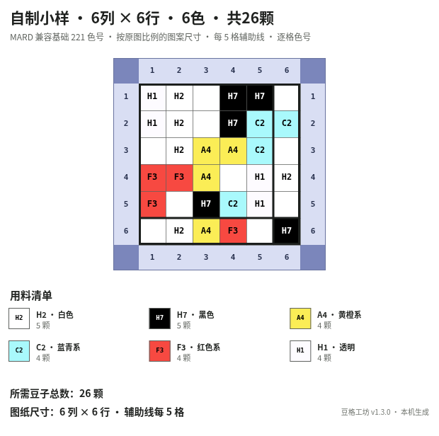](samples/white-blank-native/sheet.png) | [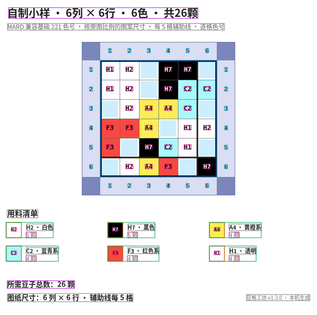](samples/white-blank-native/overlay.png) | [26 颗 / 空格 10](samples/white-blank-native/answer.json) |
| 6×6 右侧数量 | [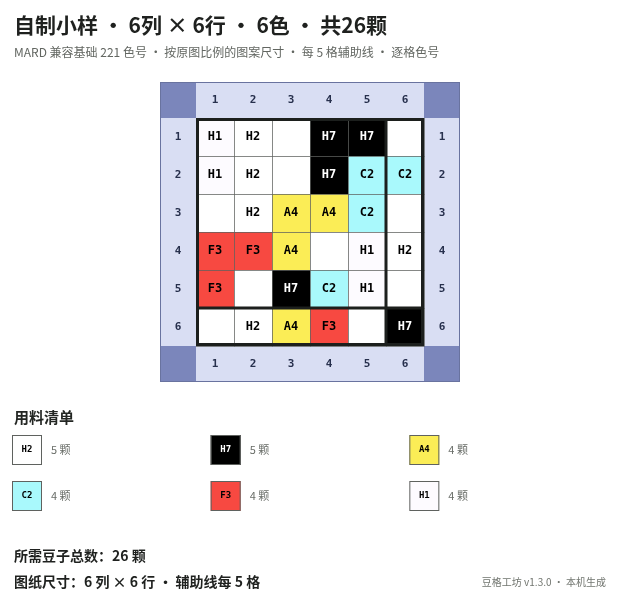](samples/white-blank-right-count/sheet.png) | [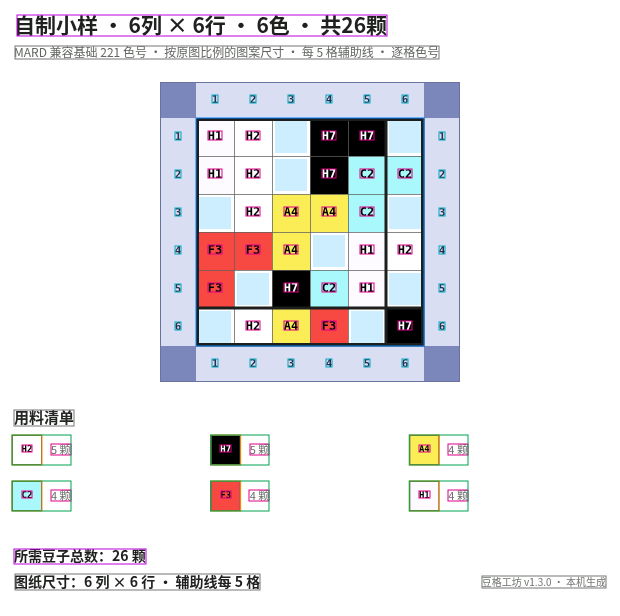](samples/white-blank-right-count/overlay.png) | [26 颗 / 空格 10](samples/white-blank-right-count/answer.json) |
| 6×6 无图例 | [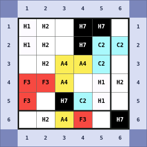](samples/white-blank-no-legend/sheet.png) | [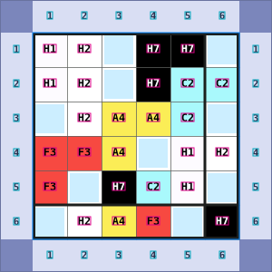](samples/white-blank-no-legend/overlay.png) | [26 颗 / 空格 10](samples/white-blank-no-legend/answer.json) |
| 8×5 十色、末行单项 | [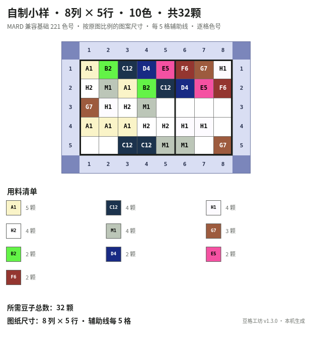](samples/ten-colors-right-count/sheet.png) | [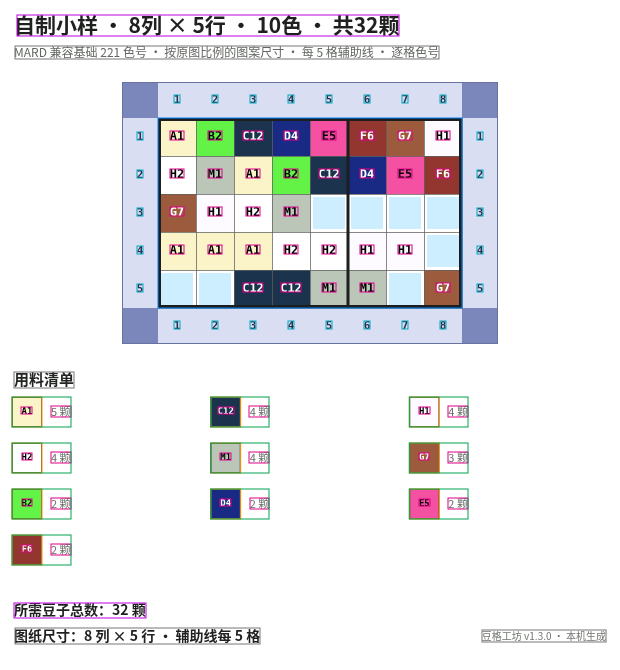](samples/ten-colors-right-count/overlay.png) | [32 颗 / 空格 8](samples/ten-colors-right-count/answer.json) |
| 8×5 无图例 | [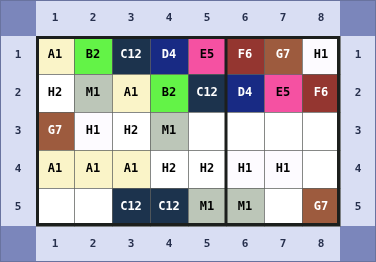](samples/ten-colors-no-legend/sheet.png) | [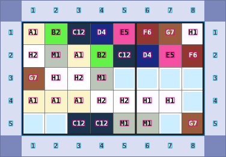](samples/ten-colors-no-legend/overlay.png) | [32 颗 / 空格 8](samples/ten-colors-no-legend/answer.json) |
| 5×8 四周留空、末行单项 | [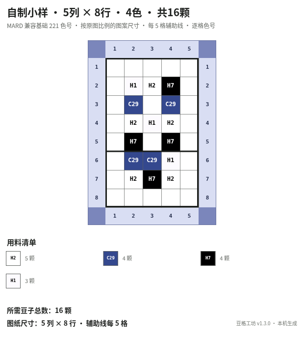](samples/sparse-edges-right-count/sheet.png) | [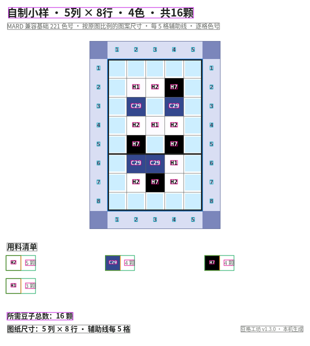](samples/sparse-edges-right-count/overlay.png) | [16 颗 / 空格 24](samples/sparse-edges-right-count/answer.json) |
| 5×8 无图例、保留空边 | [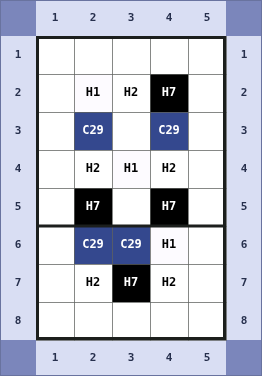](samples/sparse-edges-no-legend/sheet.png) | [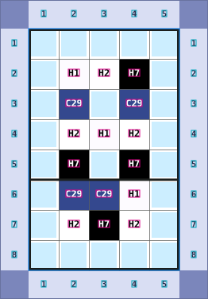](samples/sparse-edges-no-legend/overlay.png) | [16 颗 / 空格 24](samples/sparse-edges-no-legend/answer.json) |

7 张图来自 **3 份不同的自制网格**，不是 7 个独立图案来源。总计 268 个格子，制作格 174、blank 94；每张都有 H1、H2、重复色和无字空格。没有使用真图或第三方图案，也没有用冻结验证/测试图来选择参数。

## 复用了什么，改了什么

上游：[zwhy149/bead-grid-studio](https://github.com/zwhy149/bead-grid-studio)，本机取得版本 1.3.0，Git 引用 `f3d8c26`；源码检出目录 `/tmp/pindou-issue25-upstream`，保持无改动。

1. 明确网格通过上游 `createPattern` / `serializePattern` / `parsePattern` 生成及往返验证工程 JSON，统计使用上游实现。输入逐格色号是答案来源，预写逐色数量作独立对账。
2. 从上游 `src/app.js` 直接载入 `buildExportCanvas`、`getStats`、粗网格及辅助函数，在现有 Chrome 中执行。没有重写整页渲染、量化算法或画板；没有安装 Vite、Playwright、Canvas 包等依赖。
3. 仅把原生图例右侧的“色号及名称＋下一行数量”适配成“数量位于色块右侧中间”。保留原生对照图；不把原生混合图例宣称为四类中的一种完整覆盖。
4. 无图例样本直接裁取上游整页中的网格及四边编号，同时移除标题总数、图例、底部总数和说明。所有框、格子及裁块同步平移；完整空边保留。
5. 字体明确指定本机现有 Noto Sans CJK SC 与 DejaVu Sans Mono，避免系统默认字体落到白名单以外。上游名称、参考色保留在样本中，不改本项目色卡。

这是固定小网格原型：最大 12×12，当前只验证 3 份输入与这一个上游版本。入口通过明确的源码锚点载入现有函数；上游改动导致锚点不匹配就失败，不在后台替换成自写渲染器。批量生产时若该方式维护成本增加，再把同一渲染函数正式抽成导出入口；本次不做框架。

上游 `createPattern` 仍把工程 JSON 的 `appVersion` 写成 `1.2.0`，本次原样保留；实际执行的应用源码版本 1.3.0 与引用记录在 `verification.json`，不以该旧元数据字段判断运行版本。

## H1、空白和参考色

本项目 **H1 是正式制作色号**。输入 `null`、答案里的 `blankPositions`、格子标签 `blank` 才表示不放豆；`H1` 和 `H2` 均标为 `bead` 并计数。

对同一 6×6 自制输入，另运行了真实 CLI（`pixel`、`white-mode keep`、`merge 0`）：原网格 H1=4、H2=5，CLI 输出 **H1=0、H2=9**，总数仍为 26、空格仍为 10。默认量化确实排除 H1，不能拿默认 CLI 量化结果作为这批训练真值。此探针仅验证边界，不混入 7 张训练小样的答案。见 [CLI 输入](samples/white-blank-native/cli-input.png)、[CLI 输出](samples/cli-probe.json) 和 [运行记录](samples/verification.json)。

原生对照中的“H1 · 透明”是上游显示名称，不表示本项目把 H1 视为空白。上游 H1 屏幕参考色 `#FDFBFF`，项目色卡为 `#FBFBFB`；上游 H2 显示白色为 `#FFFFFF`。这些差异作为有来源的样本参考色保留，**没有写入或覆盖 `app/src/ledger/catalog.ts`**，也没有用颜色近似反推答案。

## 四类排版覆盖

依据根专项规格 `docs/specs/image-recognition.md` 的三种图例排版及 [标注决议](https://github.com/qinqiana/pindou-calculate/issues/24)：

| 已确认排版 | 本次证据 | 状态与缺口 |
| --- | --- | --- |
| 色号与括号数量同条 | 无 | **缺失**；未实现括号同条格式 |
| 色号色块右侧紧邻数字 | 3 张 `right-count` | **已覆盖清晰小网格**；数量文本为 `N 颗`，含两行/四行图例、末行单项、白色描边块 |
| 色号位于色块内、数量位于下方 | 无 | **缺失**；原生数量在色块右侧偏下，不算本类 |
| 无图例、格内色号 | 3 张 `no-legend` | **已覆盖清晰小网格**；无标题/图例数量泄漏，坐标和空边保留 |

原生对照额外展示现成模板，不扩充已确认排版类别。没有验证无边框白色色块、遮挡/模糊 `unknown`、复杂水印、JPEG/WebP、缩放、大网格或跨生成器来源；没有宣称支持这些变化。

## 图像与答案验证

- [fixtures.json](fixtures.json) 逐格和手写逐色数量相符；上游序列化往返、统计结果相符。
- 在真正执行 `fillText` 前后比较局部像素，把发生变化的像素外接矩形作为字形框；`measureText` 只用于限定扫描区域。保存的是最终像素框，**不是文字锚点或宽度估算框**。随后确认字形像素没有被后续画线覆盖；原生图与未加入记录逻辑的上游渲染逐像素相同。
- 每个制作格实际绘制文本与输入色号一一比较，blank 没有文字；图例中的色号和数量成对核验。图例色块来自实际绘制矩形，父项框是色块与对应文字框的并集。格内文字没有塞入 `code_text` 检测类别。
- 最终 PNG 重新解码验证：7 张尺寸、全部框范围、父子包含、逐格位置和数量正确；**320 个裁块**与最终 PNG 的对应区域逐像素相同；3 张无图例的本体像素与完整图一致。运行末尾再次生成第一张，图像与全部标签相同，没有串图。
- 主会话已亲自查看 **全部 7 张原图和 7 张叠加图**：H1 与白色 H2 有字、blank 无字；数字与图例框未错位；十色末行 F6 和稀疏样本末行 H1 保留；空边没有被静默裁掉。

运行证据：[渲染与 CLI 记录](samples/verification.json)、[最终文件核验](samples/saved-files-verification.json)。这是生成和标注的确定性验证，未调用 OCR/老师模型，不能作为模型准确率证据。**自行复核，未做独立 QA**：本次会话无法确认可用子代理的严格低级别关系，依现行模型边界由主会话自行复核。

## 输出文件与最短复现

本机现有依赖：Node 24.19.0、Chrome 151.0.7922.173、Python 3 + Pillow 10.2.0、fontconfig、上述两种许可字体。无新增依赖、模型权重或常驻服务。

在本票独立工作树 `/tmp/pindou-issue25-generator-reuse` 执行：

```bash
node experiments/issue25-generator-reuse/run.mjs /tmp/pindou-issue25-upstream
python3 experiments/issue25-generator-reuse/verify.py
```

也可把第二个位置参数设为新的输出目录：`node .../run.mjs <上游源码目录> <输出目录>`，相同目录会更新本原型已知输出文件。Chrome 用临时独立配置、离线本地 HTML，执行完成即退出；部分受限沙箱需要放行 Chrome 的本地 socket。代码不执行依赖安装或隐式下载。

每张样本目录包含：

- `sheet.png`、`overlay.png`：最终图纸与标注叠加。
- `pattern.json`：上游工程 JSON，逐格 `grid.cells` 和 `statistics`。
- `answer.json`：整图逐色真值、标题总数（无图例为 null）、逐格色号、空白行列位置、最终裁切区域和来源。
- `detection.json`：沿用既定类别及 `[x,y,w,h]`，坐标均在最终 PNG 上。
- `cells.json`、`recognition.json`：格子分类/文字识别裁块记录；行列零起始。仅清晰 `bead` / `blank`，不伪造 `unknown`。
- `text-proof.json`：实际绘制原文、像素框及字体，用于核对图像中文字；轴编号/备注的原文不改变既定检测 schema。
- `crops/`：本机已生成的 320 个可重建裁块，避免重复存储而不提交 Git。**新克隆分支后先运行生成入口，再运行裁块核验。**

标题检测框保留全文，但因包含当前识别字典外中文，不输出到识别器裁块清单。清单只含既定字典内的格内色号、图例色号和 `N 颗`；没有擅自扩大字符集。字典数量沿用 [学生架构勘误](https://github.com/qinqiana/pindou-calculate/issues/28#issuecomment-5882774903)，不改公共合同。

## 来源、许可和剩余适配

三份网格为本票从零编写的几何小样，不对应用户图片、第三方图库、角色或品牌图案。PNG/标签按合成原型保存，真图、权重不进 Git。上游代码 Apache-2.0、参考色资料 MIT；实际字体为 OFL-1.1 与 Bitstream Vera / DejaVu 公有领域修改，来源及原许可保留在 [notices](notices)。没有重新分发字体文件或整份上游源码；[先前调查](prior-research.md) 仅作来源背景，本次运行证据以本报告为准。

后续需要的有限适配：经用户判断后，在同一图例循环中补“括号同条”和“数量下置”两种位置；为用户接受的真实度差距逐项增加必要字号、边框或退化参数，并同步验证像素框。未知格/压缩/缩放及批量规模另验，不能以本次清晰小样代替。当前仅一个生成器来源，不证明对真实图或留出来源泛化。

未改 App，未开始训练或 Android 验收，未推进下一票。用户验收前本票保持开放；分支资产供审阅，不自动合入主线。
