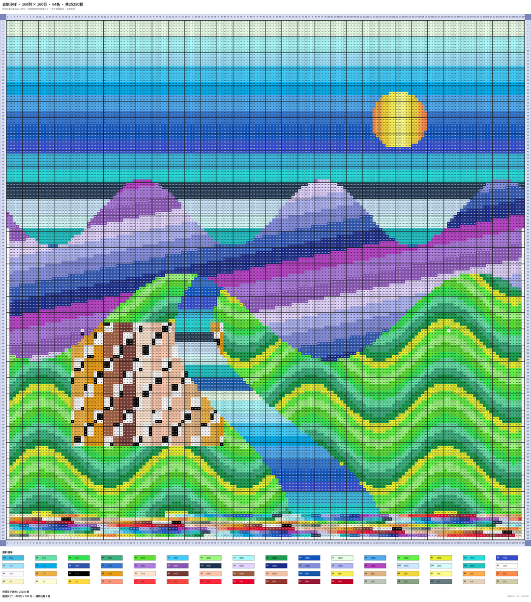
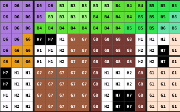
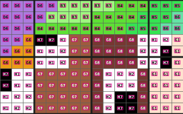
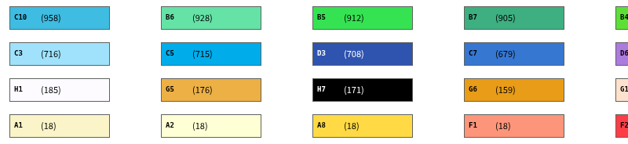
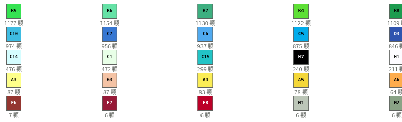
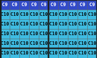
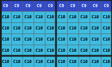

# 真实量级返修：不能用几十颗样本验收上万颗图纸

2026-09-29，接用户“不符合，安卓 App 的图纸集最多都有 25000”的反馈。本票仍开放。

**此前验收建议不成立，由主会话负责：首批最多 32 颗，只证明最小导出链路，不能支持实际规模适用性的结论。** 已回看本机保存、用于 Android 验收的原图和冻结清单，追加 3600、25250、30030 颗的自制样本；四类已确认排版都有实际图纸及对应框。仍不把大图生成成功等同于真实度、训练效果或 Android 识别通过。

## 先核对实际输入

| 已有图 | 已核实事实 | 对此次返修的意义 |
| --- | --- | --- |
| S03 | 原图 1080×1421；可见图例 64 色、合计 **25250**，参考不完整；标题为 **43116** | 25250 是可见用量，不能说是这张图的完整总量，更不能当整个图纸集上限；需验证四位数数量、多色及小字密度 |
| M021 | 3383×5782 PNG；网格 **138×239**，完整参考 **30030** 颗、64 色；无图例 | 单边超过 160 的长图在现有数据中已存在，不是未来假设 |
| S14 | 1080×2596，完整参考 3262 颗、31 色 | 图纸还包含数千颗的长图，不能只测正方形小图 |

主会话已亲自看过 S03、M021 原图。来源为本机 `dist/.datasets/pindou-real/originals/` 与 `data/issue18-real-dataset` 分支清单，均为既有 validation 条目；没有复制原图内容、参考逐色分布或人物形象来生成样本，没有改冻结划分。原图不进入本票提交，报告只记录数值。S03 的 Android 选图/识别记录见 `docs/acceptance/issues789-final-20260923/README.md`。本轮没有读取当前手机的实时数据库，不声称核查了手机当前全部图纸。

## 新的查看入口

**[四张大图与叠加图并排浏览](samples-large/index.html)**。浏览页图片是 1080 宽观察预览，点击进入原尺寸；训练标签只对应原尺寸 `sheet.png`。另附原尺寸局部供看字，避免“整图缩小看不清”掩盖框线错误。

| 样本 / 排版 | 颗数 / 空格 / 色数 | 网格 | 最终 PNG | 原图及核对入口 |
| --- | --- | --- | --- | --- |
| 右侧数量 | **3600 / 496 / 24** | 64×64 | 2248×2610；34 px/格 | [图纸](samples-large/medium-3600-right-count/sheet.png) · [叠加](samples-large/medium-3600-right-count/overlay.png) · [答案](samples-large/medium-3600-right-count/answer.json) |
| 色号与括号数量同条 | **25250 / 350 / 64** | 160×160 | 3112×3520；19 px/格 | [图纸](samples-large/dense-25250-inline/sheet.png) · [叠加](samples-large/dense-25250-inline/overlay.png) · [答案](samples-large/dense-25250-inline/answer.json) |
| 无图例格内色号 | **25250 / 350 / 64** | 160×160 | 3112×3112；19 px/格 | [图纸](samples-large/dense-25250-no-legend/sheet.png) · [叠加](samples-large/dense-25250-no-legend/overlay.png) · [答案](samples-large/dense-25250-no-legend/answer.json) |
| 色块内色号、数量下置 | **30030 / 2952 / 64** | 138×239 | 2694×5067；19 px/格 | [图纸](samples-large/tall-30030-below/sheet.png) · [叠加](samples-large/tall-30030-below/overlay.png) · [答案](samples-large/tall-30030-below/answer.json) |

三份从零编写的山水/小镇几何网格，四张图，其中 25250 颗有图例/无图例为同一网格，不当作两个独立来源。64 色边饰、H1/H2/H7 插入点是显式测试内容；不是从真实作品量化得到。所有格子分别保存色号或 null，所有四张都有 H1、H2 与 blank；数量来自实际制作格，不靠改标题凑成大图。



原尺寸 H1 局部与框线：




括号同条、数量下置的原尺寸局部：




## 大图实测暴露的三个有限适配点

1. **粗线压字，已修复本原型。** 上游把格内字号最低固定为 9 px，大图缩到 19 px/格时，`C10` 等三字符色号被随后绘制的 3 px 粗线覆盖。像素校验首次实际报错 `Overpainted text: C10 at 45.5,906.75`，没有把被覆盖的图片算通过。保留现有字号计算，只将本地适配的最低字号改为 7 px；中小图字号不变。重新检查每个字形变化像素，确认未被后续绘制覆盖。
2. **整页导出像素上限，需本地参数适配。** 138×239、64 色图例在最小格距下仍超过上游默认 1200 万像素，原函数实际抛出 `export-memory`。仅本原型对此失败分支将上限设为 1400 万，最终输出约 1365 万像素。没有修改 Android 图片限制或上游 checkout，没有声明手机可用此渲染内存规模。
3. **工程 JSON 重导入上限，尚未修改。** 上游 `createPattern` 与整页渲染可处理 138×239，但 `parsePattern` 硬性限制单边 ≤160，实际返回 `Invalid pattern dimensions: 138x239`。前向图纸、JSON 数据和训练答案均已验证；**不能宣称这张长图可在原工具直接重新导入编辑**。若后续需要编辑器工程往返，须针对现有校验及画板能力另做有限放宽验证。

另外只在现有图例循环中补括号同条/数量下置的位置和色块宽度，没有重写整页渲染器。数量格式禁用千位逗号，对应现有图纸及既定认字字符集；没有扩字典。

字号调整前后（原尺寸，同一图案位置）：




为处理约九万格，标注导出由逐格遍历全部文本改为按行列索引直接对应，像素证据改用连续数组，避免无必要的平方级比对和大量小数组。这只是批量标注入口改动，不是新增制图算法。

## 实际验证与未通过项

- 4 张原尺寸 PNG 的逐格色号、blank 位置、逐色统计、图例色号/数量与输入网格相符；全部检测框和文字外接框对应最终 PNG。
- **88582 个实际保存的裁块**重新解码后，与最终 PNG 对应区域逐像素相同；包含完整格子和图例文字。无图例图裁切后与有图例版的网格像素相同，标题和数量没有泄漏。
- 主会话亲自看过四张整图、叠加图及大图字形、H1/白格、括号数量、下置数量的原尺寸局部。旧 7 张小样另在临时目录重跑，PNG、叠加图及核心标签与原交付逐字节相同，原目录未被替换。
- [生成记录](samples-large/verification.json) 如实保留上游导入/导出失败和当前适配。大图使用字号适配，不能宣称它与未修改的上游原图像素完全相同；原样像素一致只适用于未改变字号的历史控制组。
- [最终文件核验](samples-large/saved-files-verification.json)。**自行复核，未做独立 QA**，沿用当前无法确认严格低级别 QA 模型的限制。

**仍未证明真实训练覆盖。** 1080 宽预览里格内文字已非常小，图例也随整页一起缩小，尚不能保证像 S03 那样“密集小网格＋相对较大图例”的截图比例。预览不附训练标签，也不当作清晰认字样本；正式做缩放/压缩训练数据时，还须分别处理图例字号、可读性及 unknown 标签。此结论是实际看图后的剩余差距，不再让用户仅凭小图替我们发现规模问题。

当前四类结构和上万颗体量已补齐，真实图案复杂度、压缩与水印仍未覆盖。没有训练、老师标注调用、模型准确率测试或 Android 运行验收；票据继续开放，不推进下一票。

## 复现

仍用本票独立分支 `prototype/issue25-generator-reuse`；上游源码引用和现有依赖不变。

```bash
python3 experiments/issue25-generator-reuse/make-large-fixtures.py
node experiments/issue25-generator-reuse/run.mjs /tmp/pindou-issue25-upstream experiments/issue25-generator-reuse/samples-large experiments/issue25-generator-reuse/fixtures-large.json
python3 experiments/issue25-generator-reuse/verify.py experiments/issue25-generator-reuse/samples-large experiments/issue25-generator-reuse/fixtures-large.json
python3 experiments/issue25-generator-reuse/review-large.py
```

真实图只在本机查阅。提交的是自制图纸、输入、标签、局部观察图与报告；88,582 个裁块约占本地输出的大部分文件数量，可重建且不进 Git。所有图例、坐标和逐格标签仍是已有 schema，没有改 App 公共接口、账本或色卡真源。旧小样保留为历史回归，不再充当当前验收主体。
